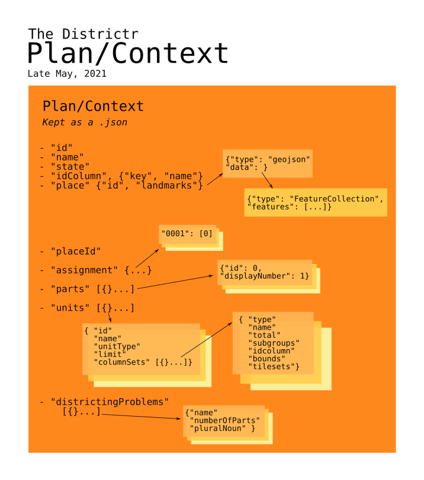

# The Districtr Model for Plans, Contexts, Assignment etc..
 

Districtr keeps track of data regarding a specific area in a JSON format
that's shared internally as a context. The sees of this format date back
to [@maxhully]'s  initial November 2018 attempts to load into our Mapbox
server. This story is detailed in the commits of repository
[`MGGG/districtr-process`], which is responsible for helping us upload
geographic data to Mapbox.

The structure of our plans are as follows...
 
 ## Identifiers
 
- `id`, Alphanumeric id individual plan
- `name`, Display name of City, County or State, loaded into the State
Pages
- `state`, State where area is located.
- `idColumn`, An object with `key`, `name` pair that identifies the id
column for base unit identifiers.
- `place`, an object pair with its own `id` and `landmarks`, an object
that contains landmarks created when identifying communities of interest
- `placeID`, Id of relevant geographic area, used throughout Districtr.

## Assignment and Parts
- `assignment`: The assignment of precincts, blocks or other units to
districts are kept in this object. This objects assigns a unit
identifier as a key to a single or array of integers corresponding to
the parts the key is assigned to, e.g. `{"001-AAA": [1] "001-AAB":
[1],...}`.
- `parts` is an array list of simple objects. Each objects lists a
zero-based `id` and its real-world, one-based `displayNumber`.

## Units
Units can be precincts or block groups and hold the important settings
on which areas a user can paint over. 

- `units` is a list of Objects of the following specification.
    ## Unit Identifier
    - `id`, identifier used throughout districtr, e.g. `"blockgroups"`
    - `name`, front-facing display name
    - `unitType`, designates whether precincts, Census units, etc.
    - `limit`, optional parameter, can limit display to `"community"`
    or `"hide"`
    ### Column Sets
    `columnSets` is a list of different data tables relevant to this
    context. JSONs without `columnSets` can still be loaded by
    Districtr. Each Object in the `columnSet` list has...
    - `type`, typically `"population"`
    - `name`, display name for `type` like `"Population"` or
    `"Voting Age Population`" or `"Households by Renters"`
    - `total`, an Object of summary statistics like column `key`,
    display `name`, `sum` and range `min`, `max`
    - `subgroups`, a list of many Objects representing non-total
    columns that mirror the `total` Object.
    - `idcolumn`, an Object of pair `name` and `key` that identifies
    the index column (and without `sum` and range)
    - `bounds`, An array of two arrays, of bounding box coordinated
    auto-populated by `districtr-process`.
    - `tilesets`, Very important pair of objects containing mapbox
    address of shapefiles to be rendered by the Map. Contains one of
    `type` `"fill"` and `"circle"`, each bearing a `source` object with
    a `type`, usually vector, and `url` mapbox:// address of the
    geometry. 

## Districting Problems
- Back at the top level, we have `districtingProblems,`an array of
various "problem" objects, typically for "Congress", "State House", and
"State Senate". Each problem has a `"name"`, `numberOfParts` and a
`pluralNoun` for display. For instance, [`Alabama.json`] has three
"problems," one each for its 7 Congressional Districts, 105 State House
Districts and 35 State Senate seats. 

A problem type might also be `community` reserved for when a user wishes
to plot [communities of interest] rather than districts.

# #

[Return to Main](../README.md)
- Next: [The State Object](./state.md)

[`State`]: ./state.md
[@maxhully]: http://github.com/maxhully
[`Alabama.json`]: ../../assets/data/modules/Alabama.json
[`MGGG/districtr-process`]: https://github.com/districtr/districtr-process
[communities of interest]: ../05landmarks/coi.md

# #

[The Metric Geometry and Gerrymandering Group Redistricting Lab](http://mggg.org)

Tufts University, Medford and Somerville, MA