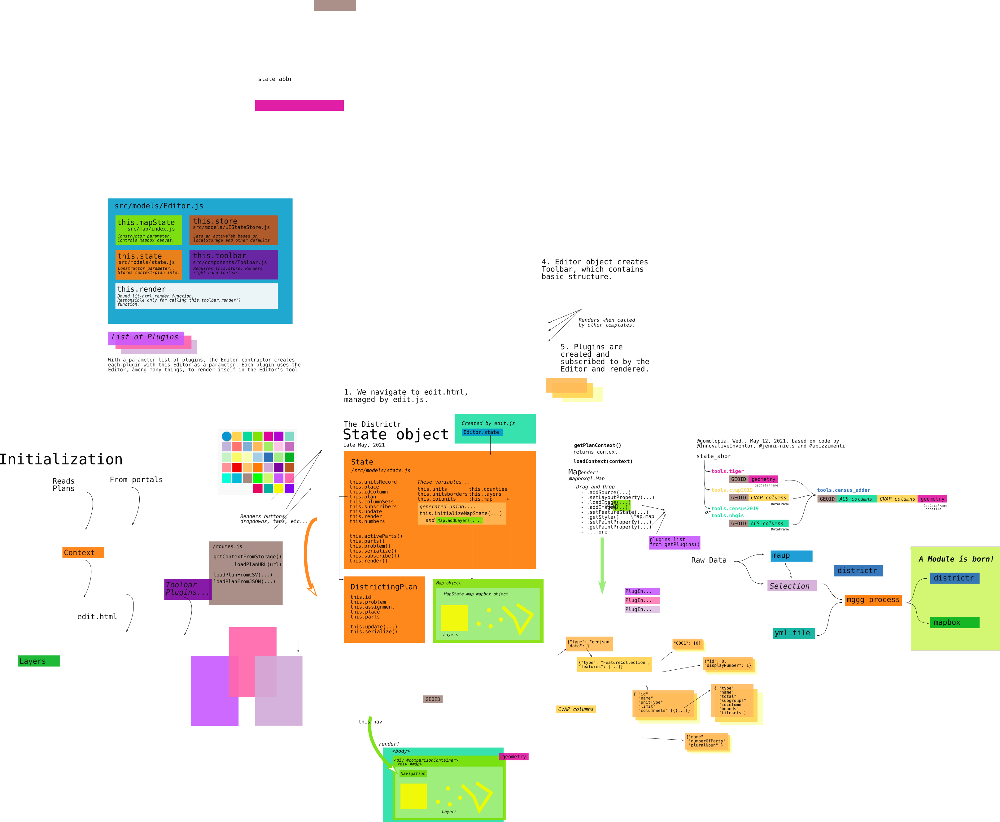

# The State Object

The current state of a plan is kept in data objects akin to those
prescribed in the districtr-json [plan/context]. These contexts are read
into [`edit.js`] and stored as a `State` object which interacts with the
[`Toolbar`] and [`Map`].



## [`src/models/State.js`]
The State object is kept as a model in its own [`State.js`] file. This
dates from about Nov 2018, written by [@maxhully]. [@mapmeld] took over
its maintenance since September of 2019. 

### Imports
Important imports include...
- `addLayers` from [`map/index.js`]
- The [`IdColumn`] class
- Utilities like `assignUnitsAsTheyLoad` from `./lib/assign`,
`generateID` from [utils]
- Column utilties from [Column Set]
- Layer functions from [Layer].

## The `State` Class
The `State` class formally retains context information read into
districtr and keeps track of changes made by the toolset, like brushing.
It is called in [`edit.js`] when `loadContext()` is ready to complete
and is collected by the [`Editor`] object with a corresponding
[`MapState`]. This is detailed in [intialization] in Chapter 02.

It's construction relies on the [`MapState.map`] Mapbox object, ready
for use within the HTML DOM, the important context/plan JSON object
`context` and a `readyCallback` function, currently set in `edit.js` to
rename the window title, indicating that loading has completed.

The important context districtr-json format contains
information about the current plan's `place`, `problem`, `id`,
`assignment`, `units` and more. Each of these pieces are kept in
instance variables like `this.unitsRecord` and `this.place`.

Meanwhile, an `IdColumn` is created based on the parameter context 
`units` and the `State`'s instance `this.plan` is created by providing
a new object of type `DistrictingPlan`. 

A complete list of instance variables are as follows. 
- `this.unitsRecord`, from `districtr-json.units`
- `this.place`, `districtr-json.place``id`,`landmark` pair
- `this.idColumn`, `districtr-json.idColumn` identifier of base units
- `this.plan` as `DistrictingPlan` object and updates district
assignments.
- `this.columnSets`, keeps `districtr-json.columnSets` objects
- `this.subscribers`, usually Editor Object's render function `
- `this.update`, bound to the `update` instance method
- `this.render`, bound to the `render` instance method

Instance method `this.initializeMapState(` acts to intialize a new Layer
for the `Map` object using function `addLayers`, which requests
parameters `map`, `swipemap`, `unitsRecord`, `layerAdder` and
`borderId`. The map state initializers returns the following values that
are then assigned as instance variables for the `State` object.
- `this.units`, a [`Layer`]
- `this.unitsBorders`
- `this.coiunits` and `this.coiunits2` if used for COI
- `this.counties`
- `this.layers`, which looks for `units`, `points`, `bg_areas`, 
`precincts`, `new_precincts` and `tracts` layers
- `this.map`, the map itself, as DOM object.

Finally, other instance variables are used that are not initialized here
like `state.numbers` generated by `NumberMarkers` and
`state.population`, among the many created in [Column Set].

State keeps the following instance methods apart from its `constructor`
and the `initializeMapState` functions.
- `activeParts()` returns DistrictingPlan parts that are set to visible.
- `parts()`, returns all DistrictingPlan in the plan. 
- `problem()`, specific DistrictingPlan speficiation on offices and
district numbers
- `serailize()`, returns a json format string of the current map state
- `subscribe(f)`, subscribes external subsribers to be rendered with
state
- `render()`, for lit-html, renders each subscriber into template

## The `DistrictingPlan` class
The `DistrictingPlan` is the first in a set first suggested by
[@maxhully] in future refactoring.

A `DistrictingPlan` requires or generates an `id`, a `state`, a
`problem`, an `assignment`, a `place`, a number of `parts` with caveats
for mutlimember of community type problems and saves them as instance
variables.

Methods include...
- `update(feature, part)` assigns a single feature to a district part
- `serialize` which returns a a portion of the districtr JSON object

# # 

### Suggestions

On Mon., Apr. 22, 2019, [@maxhully] suggested that this State class be
broken up, as mentioned above.

```
// We should break this up. Maybe like this:
// [ ] MapState (map, layers)
// [ ] DistrictData (column sets) ?
// [x] DistrictingPlan (assignment, problem, export()) ?
// [ ] Units (unitsRecord, reference to layer?) ? <--- really need this
one
// "place" is mostly split up into these categories now.
```

Finally, `State.initializeMapState(...)` calls and returns from only one
function. Is it needed?

# # 

[Return to Main](../README.md)
- Previous: [The Plan/Model JSON](./plancontext.md)

[@maxhully]: http://github.com/maxhully
[@mapmeld]: http://github.com/mapmeld

[`src/models/State.js`]: ../../src/models/State.js
[`State.js`]: ../../src/models/State.js

[plan/context]: ./plancontext.md

[`Map`]: ../02editormap/map.md
[`MapState`]: ../02editormap/map.md
[`MapState.map`]: ../02editormap/map.md#map
[`addLayers`]: ../02editormap/layer.md

[`Toolbar`]: ../03toolsplugins/toolbar.md

[`IdColumn`]: ../idcolumn.md

[`src/models/State.js`]: ../../src/models/State.js
[`State.js`]: ../../src/models/State.js
[`map/index.js`]: ../../src/map/index.js

[`edit.js`]: ../../src/views/edit.js

[utils]: ../10spatialabilities/utils.md
[Column Set]: ../06charts/columnsetsparts.md
[Layer]: ../02editormap/layer.md
[`Layer`]: ../02editormap/layer.md

[`Editor`]: ../02editormap/editor.md

[intialization]: ../02editormap/initialization.md

# #


[The Metric Geometry and Gerrymandering Group Redistricting Lab](http://mggg.org)

Tufts University, Medford and Somerville, MA