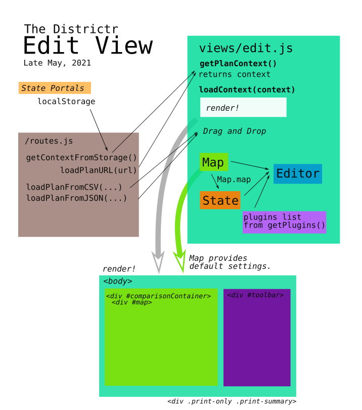
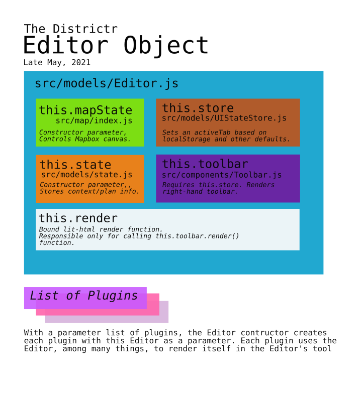

# The Editor



Districtr's primary tool for engaging with district maps is known as the
Editor. According to the [deployment], requests to address /edit/ are
sent to [edit.html], which loads a compiled version of edit.js that
corresponds to [src/views/edit.js]. One can arrive here by including
a saved plan link or by navigating in from the state pages.

[lit-html] is the framework we use to connect javascript to html
templates for rendering. 

> [Context] is another name for map-plan or saved-state, the
structure behind the JSON object that keeps units and assignments for
each plan. 

## [src/views/edit.js]
First written by [@maxhully], betwen January and August 2019.
Maintained by [@mapmeld] since September of 2019. VRA functionality
added by [@jenni-niels]. 

### Imports
Important imports include...
- [MapState]
- [State]
- External plan functions from [routes.js]
- Editor, the class
- various plugins
- various utilities. 

### Rendering
The default renderer function, `renderEditView()`, simply calls
`getPlanContext(...)` and passes this context to `loadContext(context)`.

### Function `getPlanContext()`
Before an `Editor` object is loaded, `getPlanContext(...)` retrieves any
potential context a variety of ways. First,
`getPlanURLFromQueryParameter()` is called in case a context is provided
by the URL. This URL could either be a saved plan with a URL, often
marked by marked by `edit`, `coi`, or `plan`. These are retrieved by
function `routes/loadPlanFromURL()`. If no old plan or new context is
found, a default `routes/getContextFromStorage()` is loaded.

### Function `loadContext(context)`

Once a context is gathered from the URL, local context or default
storage, `loadContext(...)` renders in html...
- div `#comparison-container` of class `.mapcontainer`
    - divs `#map` of class `.map`
- div `.toolbar`
- div `.print-only summary`.

Within the HTML, these divs form the foundation of the HTML editor GUI.

Using the context, a new const [`mapState` of class `MapState`] is
created. The Districtr window title now officially reports as loading. 

If the context was loaded through a saved plan, a shortened URL is
displayed. Other functionality is included in case a plan file is
dragged onto the map. 

When the mapbox area held by the `mapState` is complete, a **new
Editor object is ready to be created**, with `mapState`, [`State`] and a
list of [plugins]. 

The `State` object stores properties of the local `mapState` and signals
to the browser that loading is complete. Any assignments that remain
from the context is also loaded.

A new `Editor` model object is instantiated with the new State object
the local `mapState` and a relevant list of plugins. The rendering of
this Editor model causes the browser to complete its rendering of the
GUI HTML. 

### Helper Functions

Other helper functions include `getPlugins(context)` which provides a
list of relevant plugins listed in constants `defaultPlugins` and 
`communityIdPlugins`. When a new MapState is created, helper function
`getMapStyle(context)` is used to provide style defaults. When the plan
URL is needed by `getPlanContext()` or `loadContext()`'s short URL
display, it is retrieved by `getPlanURLFromQueryParam()`. 

### Special Cases

Contexts with `coi2` units or of `community` problem type are assigned
different plugins. Map styles are also hard coded in
`getMapStyle(context)`. The class of the document `body` also changes
if context units are `coi2` or `vra`. Map default settings are also
governed by `coi2` and `vra`.

# The Editor Object



## [src/models/editor.js]

The `Editor` model class was written by [@maxhully] in April of 2019.
It is currently maintained by [@mapmeld]. This model class contains
the `render` function needed by [lit-html] to display editing tools. 

### Imports

Important imports include... 
- [`UIStateStore`]
- a [`reducer`]
- [`Toolbar`] 

## default class Editor

Kept as a model, the editor object contains...
- `this.render` which keeps the render functions for external use.
- [`this.mapState`] and [`this.state`] which stores passed in
parameters.
- `this.store`, a [`UIStateStore`] which keeps track of which menus
or toolbars are in use and requires a [reducer]. 
- `this.toolbar`, which stores a `Toolbar` object that keeps this Editor
and its store in mind. Editor depends on its toolbar property to render
the each of the contents of the toolset in html.

The Editor object assigns itself to each of the plugins and the render
function calls on its own Toolbar to render. The editor's render
function is subscribed to (waits for) `this.store` and `this.state`.


# IDColumn Class

Only exits in State.js and the full code is presented below. It carries
only a `key` and `name` as instance variables and a getter as an
instance method.

```
export default class IdColumn {
    constructor({ key, name }) {
        this.key = key;
        this.name = name;
    }
    getValue(feature) {
        if (feature.properties === undefined) {
            return undefined;
        }
        return feature.properties[this.key];
    }
}
```

# # 

### Suggestions

- Plugins require but are independently created from the Editor. Could
these be created in views/edit.js instead?
- UIStateStore is only created once, here. Couldn't reducer be imported
in the UIStateStore file? 
- For simplicity's sake, file drag-and-drop functionality in edit.js
should be written in a different function or dropped.
- When rendering edit.js, div `#comparison-container` may be
experimental

# # 

[Return to Main](../README.md)
- Previous: [How is the Districtr Editor page loaded?](../02editormap/initialization.md)
- Next: [The Map Object](../02editormap/map.md)
- [Adding Layers](../02editormap/layer.md)
- [Number Markers](../02editormap/numbermarkers.md)
- [Layer Overlay](../02editormap/layeroverlay.md)

[@maxhully]: http://github.com/maxhully
[@mapmeld]: http://github.com/mapmeld
[@jenni-niels]: http://github.com/jenni-niels

[`this.state`]: ../01contextplan/state.md
[State]: ../01contextplan/state.md
[`State`]: ../01contextplan/state.md
[Context]: ../01contextplan/plancontext.md

[MapState]: ../02editormap/map.md
[`this.mapState`]: ../02editormap/map.md
[`mapState` of class `MapState`]: ../02editormap/map.md

[edit.html]: ../../html/edit.html
[src/views/edit.js]: ../../src/views/edit.js
[src/models/editor.js]: ../../src/models/editor.js

[`UIStateStore`]: ../03toolsplugins/uicomponents.md
[plugins]: ../03toolsplugins/plugins.md
[reducer]: ../03toolsplugins/actionsreducers.md
[Toolbar]: ../03toolsplugins/toolbar.md
[`Toolbar`]: ../03toolsplugins/toolbar.md


[deployment]: ../09deployment/headersredirects.md
[routes.js]: ../09deployment/routes.md

[lit-html]: https://lit-html.polymer-project.org/

# #


[The Metric Geometry and Gerrymandering Group Redistricting Lab](http://mggg.org)

Tufts University, Medford and Somerville, MA