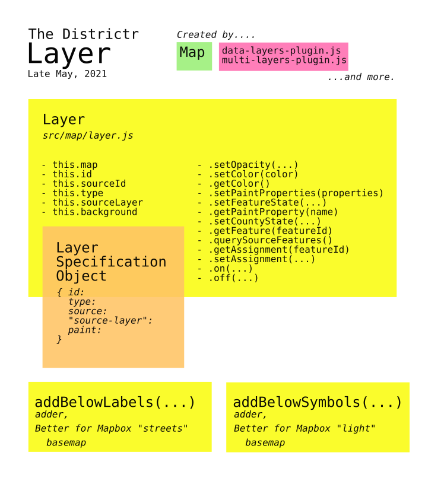

# The `Layer` Object
The layer class is one day younger than the [`MapState`] class,
having been first written by [@maxhully] as `src/Layer.js` on Tues.,
Oct. 23, 2018. By Halloween, it was moved to `src/Layers/Layer.js` and
moved into the `/src/map/` folder in anticiption of the big [pull #68]
that merged [@maxhully]'s work into [@districtr]'s repository. It has
been maintained by [@mapmeld] since the Fall of 2019.

## Use

If you've been paying attention, the [`map/index.js`] script has up to
11 ways to make new layers.

- `addUnits(...)` makes up to four.
    - `units`
    - `units-borders`
    - `coiunits`, currently disabled
    - `coiunits2`, disabled as above. 
- From function `addPoints(...)`
- From function`addPrecincts(...)`
- From function `addCounties(...)`
- From function `bgs(...)`
- And when city borders are invoked...
    - `city_border`
    - `city_border_poly` for city holes.

Elsewhere, new Layers are created...
- In [`src/plugins/data-layers-plugin.js`] and
`multi-layers-plugin.js`
    - For the many, many module-based layer combinations 
- In [`src/components/Landmark.js`] as an instance variable of
`Landmarks`
- In [`src/map/NumberMarkers.js`], which adds number markers to the map. 
- In various ways in the `districtr/src/layers/` folder
    - [`Overlay.js`]
    - `OverlayContainer.js`
    - `PartisanOverlayContainer.js`
    - `amin_control.js`
    - `colleges_hospitals.js`
    - `counties.js`
    - `current_districts.js`

## Back to `src/map/Layer.js`

The `Layer.js` file still retains some of [@maxhully]'s original
documentation. 

### The `Layer` Class

The `Layer` class is always constructed with three parameters. The `map`
function, a mapboxgl [`MapState.map`] that renders to the viewer, a
`layer` object specification that conforms to Mapbox style, and a helper
`adder` function. Upon construction, it is added to the map, with or
without an `adder` function, and the `getFeature()` instance method is
bound to this instance. 

Instances of this class are then given getter and setter methods...
- Paint property functions...
    - `SetOpacity(opacity)`
    - `setColor(color)`
    - `getColor()`
    - `getPaintProperties(properites)` 
    - `setPaintProperty(name, value)`
    - `getPaintProperty(name)`
- Feature functions passed in from the mapboxgl `map` object
    - `setFeatureState(featureId, state`
    - `getFeatureState(featureId)`
    - `getFeature(featureId)`
    - `queryRenderedFeatures()`
    - `querySourceFeatures()`
    - `getAssignment(featureId)`
    - `setAssignment(feature, part)`
- `on(type,...args)` and `off(type,...args)` for mapboxgl
- `untilSourceLoaded(callback)`
- finally, a `handler` function

### Mapbox Layer Style Spec 

A styled layer object is a simple object with...
- an `id`
- its `source`
- its `type` be it `"line"`, `"point"`, `"polygon"`, etc.
- A `paint` sub-object with `line-color`, `line-opacity` and
`line-width`

### Adder functions

Adder functions are designed to order layers properly. As [@maxhully]
wrote,  "The addBelowLabels method gives the right look on the Mapbox
"streets" basemap, while addBelowSymbols gives the right look on the
"light" basemap." Each function is automatically given the mapboxgl
`map` and `layer` style spec when it is added.

# #

### Suggestions

- Given the nearly two dozen ways layers are created, there's surely a
way to categorize and standardize the creation of layers with a more
predictable form.
- `Layer` objects and a `layer` specification object are titled in such
a way that it is easy to confuse

# #

[Return to Main](../README.md)
- [How is the Districtr Editor page loaded?](../02editormap/initialization.md)
- [edit.js and the Editor Object](../02editormap/editor.md)
- Previous: [The Map Object](../02editormap/map.md)
- Next: [Number Markers](../02editormap/numbermarkers.md)
- [Layer Overlay](../02editormap/layeroverlay.md)

# #

[The Metric Geometry and Gerrymandering Group Redistricting Lab](http://mggg.org)

Tufts University, Medford and Somerville, MA

[@maxhully]: http://github.com/maxhully
[@mapmeld]: http://github.com/mapmeld
[@districtr]: http://github.com/districtr

[`MapState`]: ./map.md
[`MapState.map`]: ./map.md#map

[`Overlay.js`]: ../02editormap/layeroverlay.md
[`src/plugins/data-layers-plugin.js`]: ../06charts/datalayersplugin.md
[`multi-layers-plugin.js`]: ../06charts/multilayersplugin.md
[`src/components/Landmark.js`]: ../05landmarks/landmarksclass.md
[`src/map/NumberMarkers.js`]: ../02editormap/numbermarkers.md

[`map/index.js`]: ../../src/map/index.js

[pull #68]: https://github.com/districtr/districtr/pull/68

[The Metric Geometry and Gerrymandering Group Redistricting Lab](http://mggg.org)

Tufts University, Medford and Somerville, MA
