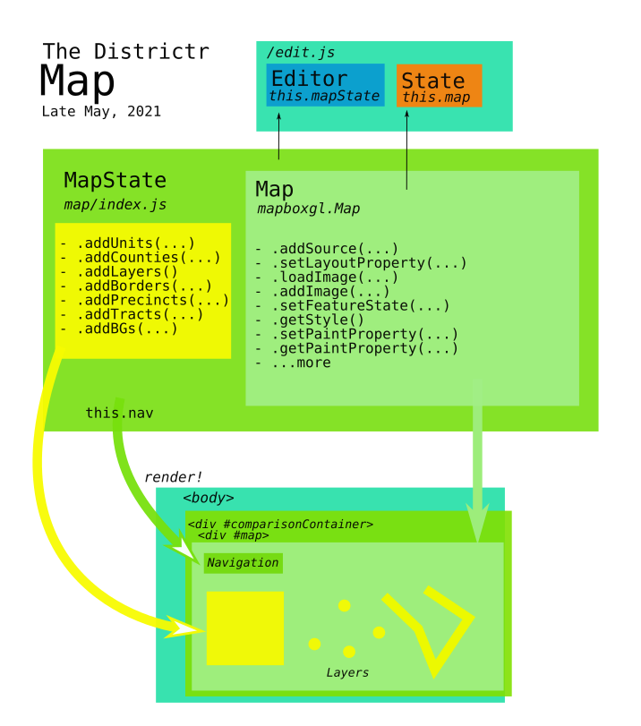

# The Map

Districtr's main editing screen contains both a Toolbar and a Map. In
the HTML, the Map is contained within nested divs 
`#comparison-container` of class `.mapcontainer` and `#swipemap` of
class `.map` created when [`edit.js`] calls function `loadContext()`.
A `MapState` object is created upon the genesis of an [`Editor`] model
object, updated as a context is loaded and rendered as part of the
`Editor` after a [`State`] object is created.

## [`src/map/index.js`]
The Map object is kept in the javascript map index file. Dates from
about Oct 2018 as src/map.js on [@maxhully]'s original districtr repo.
Moved into map folder in Nov. '18 and merged into current districtr repo
on August 17, 2019 in [pull #68].

Maintained by [@mapmeld] since October of 2019 with contributions by
[@AtlasCommaJ].

### Imports
Important imports include...
- `mapboxgl` and `MapboxCompare` provided to us from [mapbox]
- `colors` paint properties
- the `Layer` object
- other `utils`

### The `MapState` class 

The `MapState` class is based on the `Map` provided by Mapbox and its
[`mapboxgl`]. We define `this.mapboxgl`as a mapbox-type map with options
such as...
- `container`, its home in the HTML DOM
- `mapStyle`, a settings parameter provided on construction
- Map defualts for `center` and `zoom`
- GUI and display options like `attributionControl`, `pitchWtihRotate`,
`dragRotate`, `preserveDrawingBuffer`, `dragPan`, `touchZoomRotate`
- more options as needed, passsed in as a parameter on contruction.

In addition, this object contains `this.nav` that serves as Navigation
Control, as provided by `mapboxgl`. 

### The `addUnits` function

After the default `Map` class is defined, helper method `addUnits` is
defined, which takes in the following parameters...
-`map`, `Map` object to be acted upon
-`parts`, object containing directory of plan parts, for use when
determining color properties.
-`tileset`, a Mapbox tileset object stored in the cloud
-`layerAdder`, a utility function that describes the front-back order of
added layers.

This function returns a collection of four [`Layer`] objects as follows. 

- `units`, a layer of standard, paintable precinct/census units, set to
specifications from `colors`
- `unitsborders`, a layer of borders around these units, set to
specifications from `colors`

The following are currently disabled by `if (false)`

- `coiunits`, a layer created if the original tileset has `precincts` or
`counties` to ensure the use of census block groups.
- `coiunits2`, either null, or a layer of invisible units if the source
layer doesn't contain block groups.

A description of the [`Layer`] object.

### Additional helper functions

- `addPoints(map, tileset, layerAdder)`, a `Layer` of circles
corresponding perhaps to landmarks, whose default opacity is 0. 
- `addPrecincts(map, tileset, layerAdder)`, a `Layer` of new state
voting precincts, whose default opacity is 0. 
- `addCounties(map, tileset, layerAdder)`, a `Layer` of extra census
based tracts, whose default opacity is 0. 
- `addCounties(map, tileset, layerAdder)`, a `Layer` of state counties,
that have the ability to be hoverable in the map editor. We source these 
- `addBGs(map, tileset, layerAdder)`, a `Layer` of state counties, that
have the ability to be hoverable in the map editor. We source these 

### Adding [Layers] with `addLayers`
Since settings of which layers to display in the Map are `State`
specific, it is this object which initizalizes the map's layers. Thus,
Map function `addlayers(...)` is of vital important. This function
includes the following parameters:
- `map`, a `MapState` object defined in `edit.js` passed to State and on
to this function. 
- `swipemap`, a boolean related to experimental swipe feature.
- `parts`, a prescribed number of districts
- `tilesets`, the mapbox db source for the unit shapes
- `layerAdder`, different `Layer` display functions depending on whether
the problem is district or community of interest-related
- `borderId`, corresponding to the context `place.id`. 

Each tileset is added as a the Map's mapbox-gl map object's Source and
logic is applied that triggers the helper functions above.

- In one case, when `borderId` exists and that specific place/area is
permitted by `spatial_abilities` to `load_coi`, and if there are exactly
two tilesets and neither of them are blockgroups, we add to the map the
original source layers ensured to be `"blockgroups"` rather than
`"precincts"` or `"counties"`...
- `addUnits(...)` and `addPoints(...)` are always invoked. 
- If the `borderId` indiciates a local Arizona place, `addBGs(...)` is
invoked 
- If `spatial_abilities` permits `coi2` for a certain `borderId`/place,
and the tilesets include`coi2`, `precincts`, `new_precincts` are loaded
with `addPrecincts(...)` and tracts are added with `addTracts`. (`coi2`
is currently only in use with North Carolina.)
- `counties` are always added using the `COUNTIES_TILESET` found in
`utils`. 
- If `spatial_abilities` imply that a certain `borderId`/place indicates
that a border is appropriate, i.e. that city boundaries are found, we
display them with a thick border. These city lines are added as sources,
and new Layers are created.

All of these Layers, except for city boundaries, are returned by the
`addLayers(...)` function.

Maps that deal with communities of interest additionally use
`addPrecincts`  and `addTracts`. If city borders are used in a coi map,
this city's boundaries will be rendered thick. 

Finally, vesitages of the experimental _swipe maps_, are retained in
certain parameters.

* * *
 
### Other Features and Exceptions
- In June of 2020, a pilot of swipe functionality was committed to
pertain only to Georgia. 
- `coi2` is only in use with North Carolina and local Arizona places are
granted special dispensation. 

# # 

### Suggestions
- `this.mapboxgl` instance variable not used
- "Units" is used in many ways. Perhaps the units layer could be renamed
for clarity, e.g., `return(units_layer...` instead of
`return (units...`
-`borderId` could be renamed given that it corresponds to `place.id`. 

# #

[Return to Main](../README.md)
- [How is the Districtr Editor page loaded?](./initialization.md)
- Previous: [edit.js and the Editor Object](./editor.md)
- Next: [Adding Layers](./layer.md)
- [Number Markers](./numbermarkers.md)

[@gomotopia]: http://github.com/gomotopia
[@maxhully]: http://github.com/maxhully
[@mapmeld]: http://github.com/mapmeld
[@AtlasCommaJ]: http://github.com/AtlasCommaJ
[@jenni-niels]: http://github.com/jenni-niels

[plan/context]: ../1contextplan/plancontext.md
[`State`]: ../1contextplan/state.md

[`Editor`]: ./editor.md
[`Map`]: ./map.md
[`MapState`]: ./map.md
[`MapState.map`]: ./map.md#map
[`mapbox instance`]: ./map.md#map
[`Layers`]: ./layer.md
[`map/Layer`]: ./layer.md
[`addLayers`]: ./layer.md
[`map/Layer`]: ./layer.md

[`Toolbar`]: ../3toolsplugins/toolbar.md
[`UIStateStore`]: ../3toolsplugins/uistatestore.md
[`OptionsContainer`]: ../3toolsplugins/optionscontainer.md
[dropdown menu]: ../3toolsplugins/topmenu.md

[`reducers`]: ../3toolsplugins/actionsreducers.md

[`mapboxgl`]: https://docs.mapbox.com/mapbox-gl-js/api/
[mapbox]: https://docs.mapbox.com/mapbox-gl-js/api/

[`IdColumn`]: ./idcolumn.md

[`utils`]: ./utils.md
[`./lib/column-set`]: ./columnset.md

[`edit.js`]: ../../src/views/edit.js
[`views/edit.js`]: ../../src/views/edit.js
[`src/models/State.js`]: ../../src/models/State.js
[`State.js`]: ../../src/models/State.js
[`map/index.js`]: ../../src/map/index.js
[`index.js`]: ../../src/map/index.js
[`src/map/index.js`]: ../../src/map/index.js

[`deploy/_redirects`]: ../../deploy/_redirects
[`routes.js`]: ../../src/routes.js
[`package.json`]: ../../package.json
[`edit.html`]: ../../html/edit.html
[`models/editor.js`]: ../../src/models/editor.js

[`/src/map`]: ../../src/map

[pull #68]: https://github.com/districtr/districtr/pull/68

