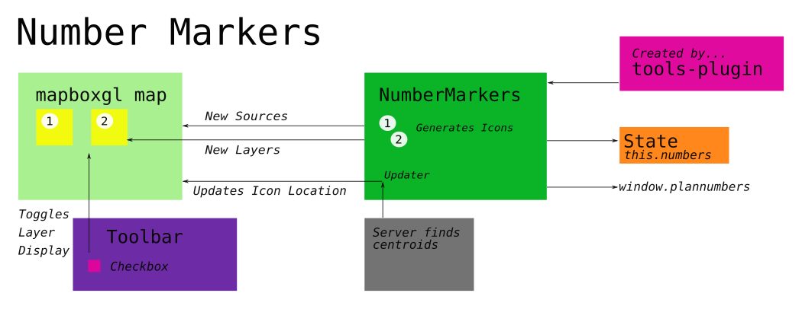

# Number Markers

When drawing districrs, users have the option of having district numbers
displayed. While it takes some lifting to generate and plot the number
markers themselves, this is a good example of how the districtr system
coordinates between the maintenance of information and its display as a
layer on the main map editor. 

Number Markers primeired on Mon., Feb. 10, 2020 by [@mapmeld] with
additional updates by [@jenni-niels]. To this day, it is maintained by
both.



## Activation

The responsibility of including number marker functionality rests on two
lines in [`tools-plugin.js`].

This file contains function [`ToolsPlugin`] whose task, when called by
[`views/edit.js`], is to "inflate" the [`Toolbar`] when it is created by
the [`Editor`] object. The lines are as follows...
```
import NumberMarkers from "../map/NumberMarkers";
// export default function ToolsPlugin(editor) {...
window.planNumbers = NumberMarkers(state, brush);
// ...}
```

`NumberMarkers` is the function loaded from the [`NumberMarkers.js`]
file and returns an object with a single pair, `update` assigned to a
function `updater` that takes [`state`] and `colorsAffected`. 

Inside the `ToolsPlugin` function, global object `window.planNumbers`,
belonging to the browser, assigned the the 'updater' object returned by
'NumberMarkers'.

To generate this object, `NumberMarkers` requires a pair of parameters:
Object `state`, a copy of the current details of the [context/plan] and
its assignments and [`brush`],  the interface used upon a specific
[`layer`] in the map canvas that it is tied to. 

## [districtr/src/map/NumberMarkers.js]

Number Markers is responsible for initializing and updating District
Numbers when set to display. To initialize, it must
- Create an icon using a javascript canvas
- Load this icon together with new layers and sources in the mapbox
[`map`]
- Initialize the source of each district-number-layer as a geojson
with an empty featureset.

To update, Number Markers is responsible through the update function
to...
- Collect the centroid for any painted district
- Apply that centroid to a district-number-source such that its icon is
displayed in the correct spot
- Remove any Number Markers for empty districts.

Throughout the process, there are multitudes of error catching,
specific context/plan use cases and hard coded constructions. This
doc does its best to follow the main points of the process.

### The Updater Function

At its essence, `NumberMarkers` is a function that creates a new
function `updater` that it calls once upon its creation and serves as a
global function for districtr to use. If all goes well, `updater` talks
to the canvas `map` and retrieves a "source" and sets its "data"
for every district that requires a number. Essentially...

```
X = district_num
map.getSource("number_source_X").setData(numberMarkers[X]);
```
### Layers and Layer Sources

The data plotted by Mapbox maps are derived from sources like vectors,
rasters and so on. We provide our map knowledge of number locations by
creating and passing a simple geojson for each district. Each
`number_source-x` is associated with the following object, an empty
geojson Feature Collection. 

`{type: "geojson", data" { type: "FeatureCollection", features: [] }`

In addition, when we initialize NumberMarkers (i.e., call its function,)
a new instance variable array is created for our `state` object. We
populate this array with new `Layer` objects created with the current
canvas `map`, the following layer specificaion object, and a custom
layer adder that ensures the Number Markers remain on top.

- Layer Specificiation
  - `id`, of form `number_layer_X` for each district
  - `source`, the `source` given to Mapbox, `number_source_X`
  - `paint` properties, initially `{"icon-opacity": 0}`
  - `layout` properties, initially `{"icon-image": "number_icon_X",
"icon-size": 0.75}`

When we update, we select each map layer source and reset its Feature
Collection `data` to one we generated in local variable `numberMarkers`. 

> Every number marker gets a layer!

### Number Markers Data

Local variable `numberMarkers` is initialized as an empty object when
`NumberMarkers(...)` is first called. Within the `updater` function is a
helper function known as `check_district(d_index)`. This purpose of this
function is to create or update  a source's geojson, using our server to
generate a district centroid, such that the following feature is added
to the district's Feature Collection `features` array. 
```
{ type: "Feature",
  geometry: { type: "Point", coordinates: [lng, lat] }
```
> We reach our server for generating centroid using
`http://mggg.pythonanywhere.com/findCenter?place=${placeID}&` and soon
`https://mggg-states.subzero.cloud/rest/rpc/merged_${placeID}?`. Only up
to 100 placeIDs can be requested using GET.

We also check if a district is empty. If so, we reinitialize a layer's
`features` to the null array. We also try to update districts, whose
`colorsChanged`.

### The Number Image

Mapbox allows for the storage of images that render when tied to a
specific geojson source. In our mapbox `map` we use function
`map.loadImage` to add the result of `canv.toDataURL()` to the map.
Immediately after, we use `map.addImage(...)` to add this to the canvas
under a name titled `number_icon_x`, which matches the new `Layer`
we created. It is through our specification in the `Layer` objects we
created that ties this image to the `number_layer_X` and
`number_source_X`.

The `canv` object we created is the construction of a white circle with 
black border with a number of specific font and size using native
javascript `canvas` and `canvas` 2d context functions. The `colorScheme`
from `/colors` is also used.

## Toggling

Users are able to toggle map District Numbers in the `Toolbar` under the
`Layers` tab, under its first `Section`. A toggle object is created with
a "Show district-numbers" label initialized to false. The update
function, `window.planNumbers.update(state)` is triggered and the
opacity for each `state.numbers` is set from 0 to 1. 

# #

### Suggestions

- `brush` is a parameter passed into the `NumberMarkers` function but
isn't used. 
- This function has line `map = state.units.map`, whose assignment is
equivalent to the `editor.mapState.map` and each `Layer`'s `map`. 
- The `NumberMarkers` function generates a new instance variable for
`Editor`. It would be nice to see all `Editor` instance variables
defined at once so that `Editor` is easier to conceptualize. In fact, we
may also be able to generate number-icons at 'Editor' initialization
here. 
- Note that exceptions for Louisiana, Mass. Towns, Indian Precincts and
El Paso, TX is hard coded in the code. Perhaps a global 'placeID'
function could consolidate or correction of Louisiana data could
consolidate this. 
- Icons are generated using Javscript Canvas. Could these also be
generated SVG or even CSS to simplify the code? Probably not.
- `colorsAffected` is a parameter sent to the `updated` but doesn't
appear passed when into the function when it is called. Is
`colorsAffected` also equivalent to `brush.changedColors`?
- `Layer` is used to describe its specification object as a parameter to
new  objects of `Layer` class. Would it be clearer to call this
parameter `layerspecs`? 
- GET functions can only process up to 100 district when generating
district centroids.
  - A simple way to select 100 random objects in a list is through
taking a slice of `[...array].sort(() => 0.5 - Math.random());`. For the
largest numbers, this method is not terribly fast or evenly distributed
but is very simple.
  - Meanwhile, it appears that `check_district(d_index)` only checks one
district at a time. This implies that the selection of 100 random
districts should occur before and outside the function. 

# #

[Return to Main](../README.md)
- [How is the Districtr Editor page loaded?](../02editormap/initialization.md)
- [edit.js and the Editor Object](../02editormap/editor.md)
- [The Map Object](../02editormap/map.md)
- Previous: [Adding Layers](../02editormap/layer.md)
- Next: [Layer Overlay](../02editormap/layeroverlay.md)

[@mapmeld]: http://github.com/mapmeld
[@jenni-niels]: http://github.com/jenni-niels

[context/plan]: ../01contextplan/plancontext.md

[`state`]: ../01contextplan/state.md

[`layer`]: ../02editormap/layer.md
[`map`]: ../02editormap/map.md

[`tools-plugin.js`]: ../03toolsplugins/toolsplugin.md
[`Toolbar`]: ../03toolsplugins/toolbar.md
[`ToolsPlugin`]: ../03toolsplugins/toolsplugin.md

[`views/edit.js`]: ../../src/views/edit.js
[`edit.js`]: ../../src/views/edit.js
[`Editor`]: ../02editormap/editor.md

[districtr/src/map/NumberMarkers.js]: ../../src/map/NumberMarkers.js 
[`NumberMarkers.js`]: ../../src/map/NumberMarkers.js

[`brush`]: ../04drawing/brush.md]

[`map`]: ../02editormap/map.md

# #


[The Metric Geometry and Gerrymandering Group Redistricting Lab](http://mggg.org)

Tufts University, Medford and Somerville, MA
