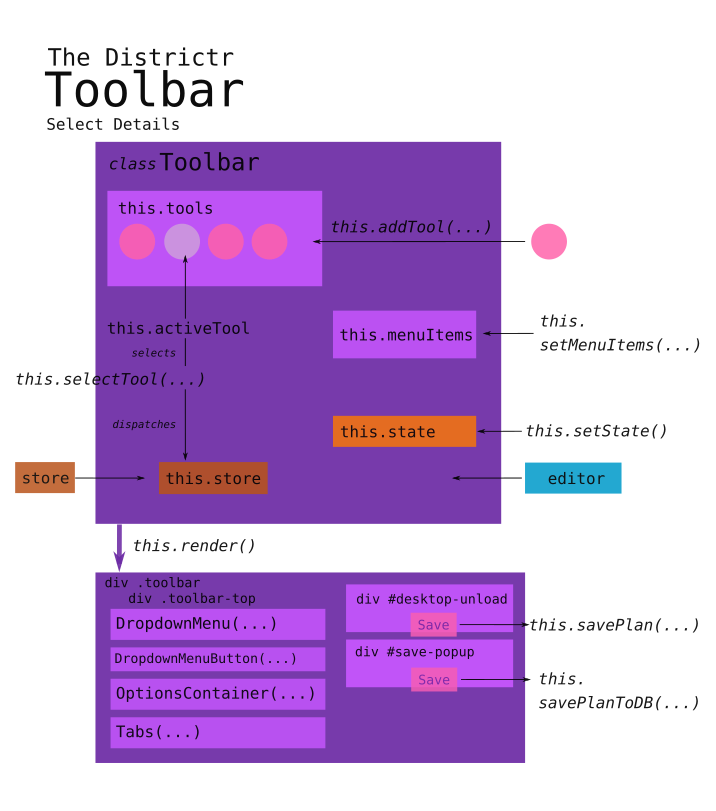

# The `Toolbar` Object

The Toolbar, which renders the right-hand panel, stems from
[@maxhully]'s  first exploration of lit-html, and began as the the
index.js file for the src/Toolbar folder on Wed., Oct. 18, 2018. Soon
after, it was refactored into its own /src/Toolbar/Toolbar.js file and
the entire Toolbar folder was moved into src/Components on Fri., Jan.
11, 2019. 

Currently, it is maintained by [Jamie], [Nick], [Jack] and [JN].

## [src/Components/toolbar.js]

An object of default class Toolbar is created by [Editor] upon
[initialization]. It is responsible for rendering a space for the
right-hand panel and keep track of available user interaction tools. 

In fact, the `Editor`'s own render function relies upon Toolbar's render
function to do most of the work. ([Map] object is created before the
Editor object and is responsible for rendering and managing the
displayed Mapbox canvas.)

**Note**, `Toolbar` itself is only the **framework** for tools and must
be waken up by [`tools-plugin.js`] to load the right tools, tabs and
menu items.

## Important Imports
- [`actions`], in `reducers/toolbar` is a reducer that watches for user
interaction with the toolbar
- As `savePlanToDB` speaks with an external server, it is imported from
[`routes`]
- `renderSaveModal` is a type of [Modal] popup
- [`spatial_abilities`] contains place-specific instructions 
- [`Tab`] and [`OptionsContainer`] are sub-units of user interface
rendered within the Toolbar.

## `default class Toolbar`

The single `Toolbar` created by Edtior.js is responsible for keeping
track of tools like [`Brush`], [`Eraser`] and more. Thus, it must render
the toolbar information panel, render a menu of tools and keep track of
which tool is selected at a time. 

### Construction

Like the Editor and the [UIStateStore], only one Toolbar is created at
the genesis of the Editor object. Currently, an instance of both is
required for the construction of a `Toolbar`.

When a `Toolbar` is created, it holds these instance variables that keep
track of its responsibilities to...
- keep track of available tools
  - `this.tools` is a list of loaded tools, determined bt the type of
problem.
  - `this.toolsById` is a parallel list of available tools
- .provide a space for menus and information
  - `this.menuItems`
  - `this.tabs`
- render and watch for interaction 
  - `this.rendeCallback`, is sent back to editor.render, essentially
asking to render itself
  - `this.store`, a copy of the running `UIStateStore`, which holds
responsibility for keeping track of which tools the user has selected.
  - `this.render`, a bound function as property
  - `this.addTool` and `this.selectTool`, two very important bound
functions tied to this instance. 
  

### Waking up the Toolbar

Since menu items and tools are state and problem dependent, the Toolbar
must be informed of which tools, tabs and menu items must be loaded. The
following instance methods are used by [`tools-plugin.js`] and more to
wake up the tool bar. (Written out of order...)

- `this.state`, _which is not initialized in the constructor_, stores
information about the current [plan/context]. 
- Since menu items are state specific, `setMenuItems(menuItems)` is used
by `tools-plugin.js` to load relevant menu items
- `addTool()` adds tool by informing tool of `this.renderCallback`, and
adds tool to both this.toolsById and this.tools.
- `activeTool()` asks `this.store` which tool is selected and returns
its ID        
- `selectTool(toolId)`, deactivates the current tool, activates the new
tool and informs `this.store`. Plugins initialize the active tool for
users this way.  `tools-plugin.js` and others use `addTabFirst(tab)` and
`addTab(tab)` to add tabs to the start and end of a toolbar's tab list,
respectively. 

### Saving Plans

In `savePlan(e)`, Toolbar provides buttons for saving plans with special
cases for non-districtr state portals. If the save is meant for an
external portal, `renderSaveModal()` is called, otherwise,
`savePlantoDB()` is called, the target button is updated and the user is
given the saved plan URL.

If the user had previously saved a plan, `unsave()` reforms this
procedure by replacing `Save` with `Update` in the user interface. 

### Rendering

Rendering is a continuous process that is called at [initialization] and
whenever [`this.store`] is dispatched. Before rendering occurs,
`Toolbar` must first collect information on which drop down menu is
currently open, i.e. `dropDownMenuOpen` from `this.store` and whether
the `Toolbar` is rendering as part of an event. 

Ultimatey, a div class `.toolbar` is created, much of which is tagged in
the html as a `<nav>`. 

Within this toolbar, there is...

- div class `.toolbar-top` which renders an icon-list that directs each
tool to render its icon (as a modified form of radio-button list) and
also includes...
  - div of id `#desktop-load` which holds the plan Save/Update button
  - div of id `"#save-popup` which reports the save url, and gives
options copy address, add a tag/event code or team/plan name. This is
sometimes hidden or revealed.
  - and the rendering of `DropdownMenuButton(...)` included as a helper
function in this file
- Afterwards, the rest of the toolbar is rendered...
  - if the` DropdownMenu(...)` is set to be revealed, it renders a list
of links sourced from the `this.menuItems` list.
  - Separate class `OptionsContainer` renders options for the specific
`this.activeTool`
  - Separate class `Tabs` are called underneath to display charts,
options and more.
  
# #

### Suggestions

- Toolbar's `this.state`, is not initialized in the constructor.
- `setMenuItems(...)` is passed a copy of information from the `State`
object by the plugins. Couldn't it just render from its own reference to
the single `State` object? 
- In `savePlan()`, `btn` is retrieved and defined three times near
identically. Is there a difference between these calls and can this
function be rewritten to reduce this redundancy?
- Could `OptionsContainer` be renamed `ToolOptionsContainer` for
clarity?
- Tabs are only effectively called here, yet is passed in `this.tabs`,
`this.store.state`, etc. Could tabs just be passed in `this,` the
`Toolbar`, and handle the rest?

# #

[Return to Main](../README.md)
- Here: [Making space for the Toolbar](../03toolsplugins/toolbar.md)
  - [Tabs and Reveal Sections](../03toolsplugins/sections.md)
  - [A List of UI and Display Components](../03toolsplugins/uicomponents.md)
  - [Rendering in Action: OptionsContainer](../03toolsplugins/optionscontainer.md)
  - [The top-bar Menu](../03toolsplugins/topmenu.md)
  - [Popups a la Modal](../03toolsplugins/modal.md)

- [UIStateStore](../03toolsplugins/uistatestore.md)
- [Actions and Reducers](../03toolsplugins/actionsreducers.md)

- [The Tools-Plugin prevails](../03toolsplugins/toolsplugin.md)
  - [The `Tool` Class and The `Pan` Tool](../03toolsplugins/tool.md)
  - [Brush and Erase Tools](../03toolsplugins/brusherasetools.md)
  - [Inspect Tool](../03toolsplugins/inspecttool.md)

- [Plugins!](../03toolsplugins/plugins.md)
  - The Tools Plugin (See Above)
  - The Data Layers Plugin (See Chapter 06)
  - The Community Plugin (See Chapter 05)
  - The Population Balance Plugin (See Chapter 06)

[@maxhully]: http://github.com/maxhully
[Nick]: http://github.com/mapmeld
[Jamie]: http://github.com/AtlasCommaJ
[Jack]: http://github.com/JDeschler
[JN]: http://github.com/jenni-niels

[plan/context]: ../01contextplan/plancontext.md

[Editor]: ../02editormap/editor.md
[initialization]: ../02editormap/initialization.md
[Map]: ../02editormap/map.md

[src/Components/toolbar.js]: ../../src/components/Toolbar/Toolbar.js
[`tools-plugin.js`]: ../03toolsplugins/toolsplugin.md
[`actions`]: ../03toolsplugins/actionsreducers.md
[Modal]: ../03toolsplugins/modal.md
[`Tab`]: ../03toolsplugins/sections.md
[`OptionsContainer`]: ../03toolsplugins/optionscontainer.md
[`Eraser`]: ../03toolsplugins/brusherasetools.md
[UIStateStore]: ../03toolsplugins/uistatestore.md
[`this.store`]: ../03toolsplugins/uistatestore.md

[`Brush`]: ../04drawing/brush.md

[`routes`]: ../09deployment/routes.md

[`spatial_abilities`]: ../10spatialabilities/spatialabilities.md

# #

[The Metric Geometry and Gerrymandering Group Redistricting Lab](http://mggg.org)

Tufts University, Medford and Somerville, MA