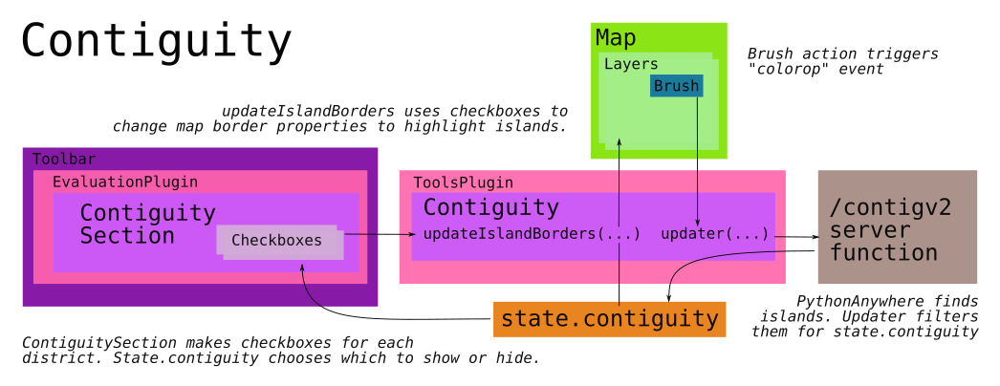

# Contiguity

Contiguity is a great example of a feature that ties together many parts
of districtr. It was originally written by [@mapmeld] between March and
December 2020 with contributions from [@lieuzhenghong] and was lightly
patterend off of [`NumberMarkers`].

As a user contends with units large and small, they may find that they
are drawing disconinuous units. To check if this is so, a button is
provided in the 'Contiguity' reveal section of the ['Evaluation'] tab of
the ['Toolbar']. When units are drawn, the plan is sent to a server
function that calculates for islands, through [`routes.js`]. Districts
with islands are listed in the toolbar with checkboxes toggling the
border highlighting of non-contiguous units.

## Loading with [`tools-plugin`] and `Contiguity Checker`

When the `Toolbar` is inflated by the `tools-plugin`, a
`ContiguityChecker` function is created if we're not in communitiies
mode and if this is permitted by `spatial_abilities`. This
`ContiguityChecker`, known as `c_checker`, which listens for any
`colorop` events signaled by the [`brush`]. The responsibilities of
`Contiguity Checker` is to... 
- Submit a state plan to the external Contiguity checker
- Use this response to update the `state.contiguity` object, which
tracks a plan's non contiguous islands.
- Checkboxes for each district with islands is rendered in the `Toolbar`
to allow users to select district boundaries for highlighting
- The borders of units in selected districts are then highlighted. 

This is acheived by `Contiguity Checker` returning an internal function
`updater` that sends the current [`state`] to server function
`/contigv2` found in [`routes.js`]. This response is parsed for errors
and if any islands are found, keys for each district in
`state.contiguity` is assigned a value representing each island.

> Noncontiguous islands are sorted by size. The area with the longest
list of units is discarded, as it is considered the main unit. 

Finally, subfunction `setContiguityStatus(issues)` is called which
controls checkboxes that allow each user to select a non-contiguous
district to highlight. Initially, when `evaluation-plugin` loads, it
uses `ContiguitySection.js` to render a checkbox with label for each
section, all set to `hidden`. Eventually, as a user edits the map,
`setContiguityStatus(...)` takes a list of non-contiguous districts and
unhides their checkbox, granting the user to highlight any islands. If
any of these boxes are checked, then subfunction
`updateIslandBorders(...)` alters the paint properties in
`state.unitsBorders` for each unit in each checked district.  

# # 

[Return to Main](../README.md)
- [Hovering over the Map](../04drawing/hover.md)
- [Painting and Erasing with Brush and Community Brush](../04drawing/brush.md)
- [Undo and Redo](../04drawing/undoredo.md)
- Previous: [The Tooltip Brush](../04drawing/tooltip.md)

[@mapmeld]: http://github.com/mapmeld
[Zhenghong Lieu]: http://github.com/lieuzhenghong

[`state`]: ../01contextplan/state.md

[`NumberMarkers`]: ../02editormap/numbermarkers.md

['Toolbar']: ../03toolsplugins/toolbar.md
[`tools-plugin`]: ../03toolsplugins/toolsplugin.md

[`brush`]: ../05landmarks/coi.md

['Evaluation']: ../06charts/evaluationplugin.md

[`routes.js`]: ../09deployment/routes.md

# #

[The Metric Geometry and Gerrymandering Group Redistricting Lab](http://mggg.org)

Tufts University, Medford and Somerville, MA