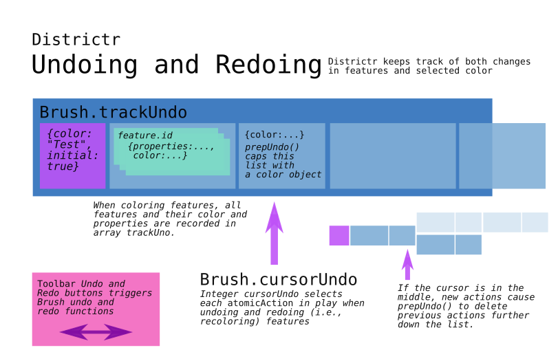

# The Undo Redo Button 

The Undo Redo Button gives us the ability to navigate through the
changes we've made in the [map] editor. [@mapmeld] concieved this
functionality on Mon. Dec. 9, 2019 and innaugurated it with buttons the
next week on Wed., Dec. 18. Undo and Redo operations only apply when
we're in paint and erase mode, so it is [`BrushTool.js`] and
[`EraserTool.js`] that is responsible for calling this function when it
is rendering its tool options. These buttons are rendered for the user
in the [`OptionsContainer`].

## [/src/components/Toolbar/UndoRedo.js]

A single function governs the rendering of the undo-redo button in the
User Interface and its interaction with the brush on the map. It thus
requires the passing of a map [`Brush`] object. Keeping it together is a
stack structure that contains recent actions.

If an undo is triggered, the `redo_brush` is enabled and if we reach the
end of the stack, the undo button is disabled. There is no more actions
before the start of the stack. 

If a redo is triggered, the `undo_brush` is enabled and if we reach the
other end of the stack, the redo button is disabled. There is nothing
left after the end of the stack. 

Finally, when we're in the middle of an action stack and color is
painted on or erased from a precinct, it will no longer redo any
previous actions. The undo button is left enabled and the redo button is
disabled. 

### Rendering

Each Brush or Eraser's `...ToolOptionsClass` is responsbile for calling
the `UndoRedo` function to render, thus placing these buttons within
section class `.tool-options` along with other divs of class `ui-label`.

A div of this class is created with the additional class
`.undoredo-option`. A legend is included and a pair of buttons, tied
with buttons, indicate the undo and redo arrows. Each button is given a
map `Brush` specific id and is tied to that Brush's `undo()` or `redo()`
functions. 

# # 

[Return to Main](../README.md)
- [Hovering over the Map](../04drawing/hover.md)
- Previous: [Painting and Erasing with Brush and Community Brush](../04drawing/brush.md)
- Next: [The Tooltip Brush](../04drawing/tooltip.md)
- [Checking for Contiguity](../04drawing/contiguity.md)

[@mapmeld]: http://github.com/mapmeld

[map]: ../02editormap/map.md

[`BrushTool.js`]: ../03toolsplugins/brusherasetools.md
[`EraserTool.js`]: ../03toolsplugins/brusherasetools.md
[`OptionsContainer`]: ../03toolsplugins/optionscontainer.md

[`Brush`]: ../04drawing/brush.md

[/src/components/Toolbar/UndoRedo.js]: ../../src/components/Toolbar/UndoRedo.js

# #

[The Metric Geometry and Gerrymandering Group Redistricting Lab](http://mggg.org)

Tufts University, Medford and Somerville, MA