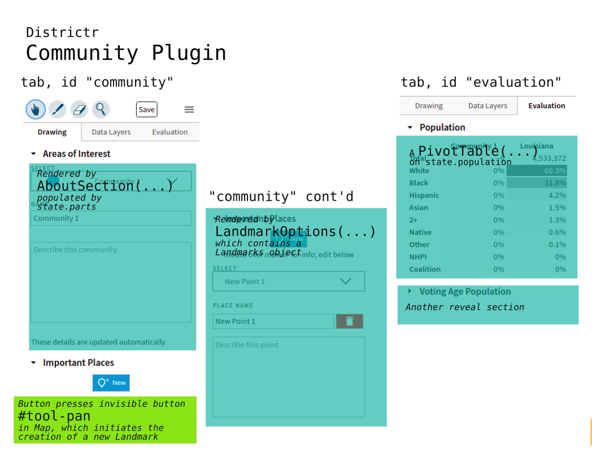

# Community Plugin

The `CommunityPlugin`, found in [`/src/plugins/community-plugin.js`],
is vital to the drawing and editing of landmarks and replaces the
[`PopBalancePlugin`] used when drawing districts as the first tab in the
toolbar.

When this plugin is loaded, it is titled  "Drawing"  and includes two
reveal sections, "Areas of Interest", painted districts that act as a
community, and "Important Places", point based landmarks. 

This tab was born on Wed., Apr. 24, 2019 and filled out over time by
[@maxhully]. It is maintained by [@mapmeld] with VRA functionality
by [@jenni-niels]. 

## Construction

The Community Plugin is designated early in a list of plugins in
`edit.js` and created when the [`Editor`] is initialized. It requires
only the `Editor` as an argument and from there, uses its instance
[`state`] and [`mapState`]. 

The [`Tab`] added to the [`Toolbar`] is titled "Drawing" and reveal
sections "Areas of Interest" and "Important Features" are loaded here.

Part of this construction is the creation of `lm`, a list of
[landmarks] from `state.place.landmarks` and `lmo`, a list of landmark
options. If needed, we create an empty `lm`, an object with `type`
"geojson" and `data`, an object of type `FeatureCollection` and an empty
array of `features`.

> Some work is used to ensure backwards compatibiility with older
style landmark lists. 

If there is no `state.map.landmarks`, then we create a new [`Landmarks`]
object passing in `state.map`, `lm` and an anonymous `addFeature`
function. We describe this function below.

A new `LandmarkOptions` object is also created with landmarks, features
and the `State` map. 

> The `State` object keeps track of landmarks using both `state.place`
and the `state.map` mapbox object.

### The Add New Feature function when Initializing Landmarks

When a new `Landmark` object is created, we pass an anonymous function
to serve as its `updateLandmarkList` function. Thus, what follows is
what happens when we wish to update the landmark list, when we create or
update features.

When we update the Landmarks list we...
- save the whole plan to local storage
- if there are any number of landmarks, we populate html element of id
`#landmark-instructions`
- if this is a new landmark...
   - The `window.selectLandmarkFeature` is set to the last index of
`lm.data.features`
   - Values for html documents of class `.landmark-select .label`, and
`.marker-form` are populated with generic New Point values based on
sequential values. 
   - The description for `lmo` is set to blank, triggering a save.
 - ...otherwise...
   - We use `window.selectLandmarkFeature` to select the relevent
landmark by updating html the landmark select text, class
`.landmark-select .label`.
 
Finally, if there are features of any length, we update display settings
and re-render the whole `state`, that is, all subscribers of `state` are
called. 
 
Otherwise, last feature in the list is set as the selected feature.
After this, the `state` is again rerendered.

## A Custom Evaluation Tab

While there exists clean ways to write custom tabs, unusual among most
plugins, the `CommunityPlugin` implements __two__ `Tab`s in the
`Toolbar`, the `Drawing` tab and a custom `Evaluation` tab that...
- implements a Population `PivotTable`
- makes a  VAP `PivotTable` if `state.vap` is activated
- a `MedianIncomeTable` if `state.incomes` is available and likewise,
- a `DemographicsTable` on renters if available.

### Adding Location Search

To help users find locations, a gazeteer search bar is included in the
top of the mapbox-gl [map]. This requires the fetch of the official
mapbox geocoder, its restriction to current canvas bounds and its
creation in the `mapBox` mapbox-gl `map` container. The
`addLocationSearch(mapState)` function that accomplishes this is called
early in the call of the first `addMapState` function. 

# Class LandmarkOptions

A new `LandmarkOptions` class, completely different from 
`LandmarkOptions` in Landmark.js, is used to allow the editing of
feature properties. It takes a list of `landmarks`, `features` and the
`map` to create instance variables `this.points`, `this.drawTool`,
`this.features`, `this.map` and `this.updateLandmarksList`.
All of the following helper functions are bound to this instance.

## Instance Functions

For every feature, one can `setName(name)`,
`setDescription(description)` and save or delete a feature. Additional
callback `onDelete()` is written so that together with
`deleteFeature(delete_id)`, the feature is removed from both area and
point `Layer`'s geometries.

## Rendering

`LandmarkOptions` also allows user elements to be rendered in the
Important Places reveal section. There are roughly three parts to this
section, which all interact with each other using `onClick` event
callbacks.

### New Button

The new button is used to create new point landmarks. 

When the new Button is clicked...
-the `window.selectLandmarkFeature` is reset to -1 to let the plugin
know we're creating a new Landmark
- the current `Tool` is set to [Pan]
- The marker name and description form is hidden, but not the dropdown
list of landmarks
- Landmark instructions are shown
- The mapbox drawpoint is used as the mouse by intracting with the
[`LandmarkTool`]

### Selecting Landmarks

When editing landmarks, we can either create it using the button
described  above or by selecting the landmark in the dropdown of class
`.option-list .landmark-list`. 

### Place Name and Description

When the landmark is selected, its properties/options load in the drop
down menu. This affects elements of `.marker-form` class, `.input` and
`extarea`. When the save button is pressed, then we
`updateLandmarkList(...)`.

> A delete button is also offered to the user that uses the
`onDelete(...)` callback function.

# #

### Suggestions

- Within this file, many functions are nested within each other.
Callbacks and helpers would help increase clarity for this file.
- Inside the `Landmarks` object, an `updateLandmarksList` is passed into
each new instance. However, when it is called, it is only sent in the
parameter `true`. It appears that passing an empty parameter to this
function means that `isNew` is false, but this is not clear.
- Usually, a plugin makes a single tab. This is not always so, but it
should. Community creates both a `Drawing` tab and a custom `Evaluation`
tab.
- Hard coding excepts Arizona municipalities, could we do this using
`spatial_abilities` instead?
- `mapState.map` is used, but remember, the mapbox-gl map is the same
object in `editor.map` and so on.
- Both the `LandmarkTool` and the `CommunityPlugin` define class
`LandmarkOptions`. They're very different from each other despite the
name. 
- A dropdown menu of Landmarks does not use the `Parameter` object.

# # 

[Return to Main](../README.md)
- [Communities of Interests in Use](./05landmarks/coi.md)
- Previous: [The Landmark Class](../05landmarks/landmarksclass.md)
- Next: [The Old Landmark Tool](../05landmarks/landmarktool.md)
- [My COI](../05landmarks/mycoi.md)
- [Finding Places](../05landmarks/findplaces.md)

[@maxhully]: http://github.com/maxhully
[@mapmeld]: http://github.com/mapmeld
[@jenni-niels]: http://github.com/jenni-niels

[`/src/plugins/community-plugin.js`]: ../../src/plugins/community-plugin.js

[`state`]: ../01contextplan/state.md

[`Editor`]: ../02editormap/editor.md
[map]: ../02editormap/map.md
[`mapState`]: ../02editormap/map.md

[Pan]: ../03toolsplugins/tool.md
[`Tab`]: ../03toolsplugins/uicomponents.md
[`Toolbar`]: ../03toolsplugins/toolbar.md

[landmarks]: ../05landmarks/landmarksclass.md
[`Landmarks`]: ../05landmarks/landmarksclass.md
[`LandmarkTool`]: ../05landmarks/landmarktool.md

[`PopBalancePlugin`]: ../06charts/popbalanceplugin.md

# #

[The Metric Geometry and Gerrymandering Group Redistricting Lab](http://mggg.org)

Tufts University, Medford and Somerville, MA