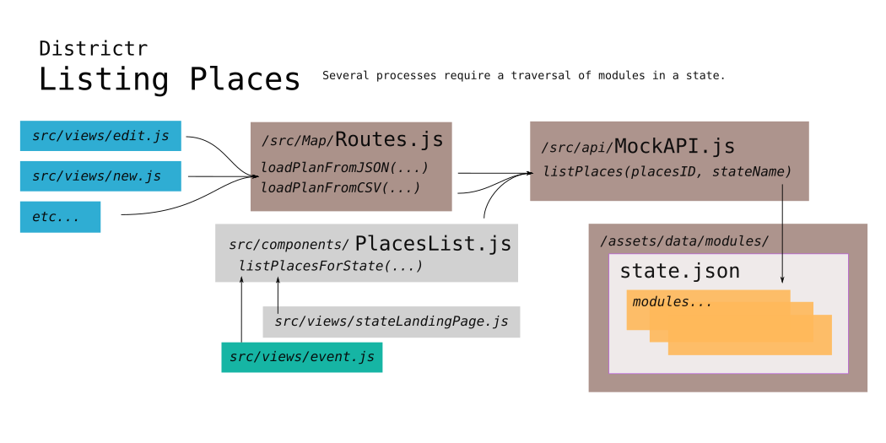

# PlacesList

Sometimes, a full or partial list of available places or modules
is required. Located in [`src/components/PlacesList.js`] are
functions that use [`mockapi.js`] to help us traverse through
available modules for presentation to the user using class `PlacesList` 

The original `PlacesList` was written by [@maxhully] early on, in Nov.
of 2018 and has been continously maintained by [@mapmeld] and
[@jenni-niels] since the Fall of 2019.

## Listing Places

The common way to collect modules, for landing pages, events and such,
is the function `listPlacesForState(...)` that is called to return an
objects of objects. In essence, this function returns the result of
function `listPlaces(...)` in `mockapi.js` and filters that by
communities-only and/or by US state. 

### `listPlaces(placeID, stateName)`

Within [`/src/api/mockApi.js`], a simple function takes two arguments,
`placeID` and `stateName` to traverse the `/assets/data/modules/`
folder. The `stateName` is most vital in this operation as module json
files are organized by this name. In fact, if a `placeID` has no
`stateName`, object `lookupState[placeID]` in `lookupOldState.js` is
used to provide one.

Other than `PlacesList.js`, function `listPlaces(...)` is only ever
called by [`routes.js`] where it is used to lookup modules by `placeID`
that are loaded by JSON or by CSV. If `placeID` is null, then all places
in a state are returned.

> The function in `mockApi.js` replaces the `listPlaces()` function
provided in `src/api/places.js`. 

## Class `PlacesList` and function `PlacesListForState(...)`

These were both once used in the more full featured version of
`PlacesMap` but have since been deprecated. 

## Helper and Communities Functions

The `community.js` view uses the `onlyCommunities()` function to set
what appears to be a global variable `justCommunities` to true. This
variable is used by function `communitiesFilter(place)` to select
places where their `districtingProblems` indicate that it is coi
oriented.

Similar functons that check module feature are `getUnits(...)`.

A pair of functions are responsible for rendering in the document.

This includes, the `problemTypeInfo` const which generates information
for `multimember` and `community` type problems and
`getProbleminfo(...)`, which is deprecated.

Function `placeItems(...)`, once used more heavily in the deprecated
Class `PlaceList`, is used in `event.js` to generate event cards.

# #

### Suggestions

Currently, the role of `findPlaces.js` is to find and match modules.
This requires traversing the entire folder of modules. This takes a lot
of effort but is done only once, so we live it. 

Object `spatial_abilities` is the next closest thing to a master list of
modules. Instead of using an API, could we extend `spatial_abilities`
such that it is a master list of modules?

For instance, we expend effort trying to extract modules related to
communities and localities, though in other parts of the code, this is
handled by `spatial_exceptions`.

We see the benefits of this when considering the function `lookupState`
from `lookupOldState.js`, used by `listPlaces.js`, where modules are
matched up to the  state they belong to, but this function is not
updated when new modules are added. 

In addition...

- Originally, in folder `/src/api`, `places.js` was used to traverse
modules. That has since been replaced by `mockApi.js`. 
- Class `PlacesList`, with its html rendering, was once used in a more
full featured version of `PlacesMap` which has since been deprecated.
- Function `placeItems(...)` was once used in `PlacesList` but is now
only used when view `event.js` produces cards for plans. Could this be
similar to the cards already generated in landing pages elsewhere?
- `getProblemInfo(...)` also doesn't appear to be used anymore

# #

[Return to Main](../README.md)
- [Communities of Interests in Use](../05landmarks/coi.md)
- [The Landmark Class](../05landmarks/landmarksclass.md)
- [The Community Plugin](../05landmarks/communityplugin.md)
- [The Old Landmark Tool](../05landmarks/landmarktool.md)
- Previous: [My COI](../05landmarks/mycoi.md)

[@maxhully]: http://github.com/maxhully
[@mapmeld]: http://github.com/mapmeld
[@jenni-niels]: http://github.com/jenni-niels

[`src/components/PlacesList.js`]: ../../src/components/PlacesList.js
[`/src/api/mockApi.js`]: ../../src/api/mockApi.js
[`routes.js`]: ../09deployment/routes.md
[`mockapi.js`]: ../../src/api/mockApi.js

# #

[The Metric Geometry and Gerrymandering Group Redistricting Lab](http://mggg.org)

Tufts University, Medford and Somerville, MA