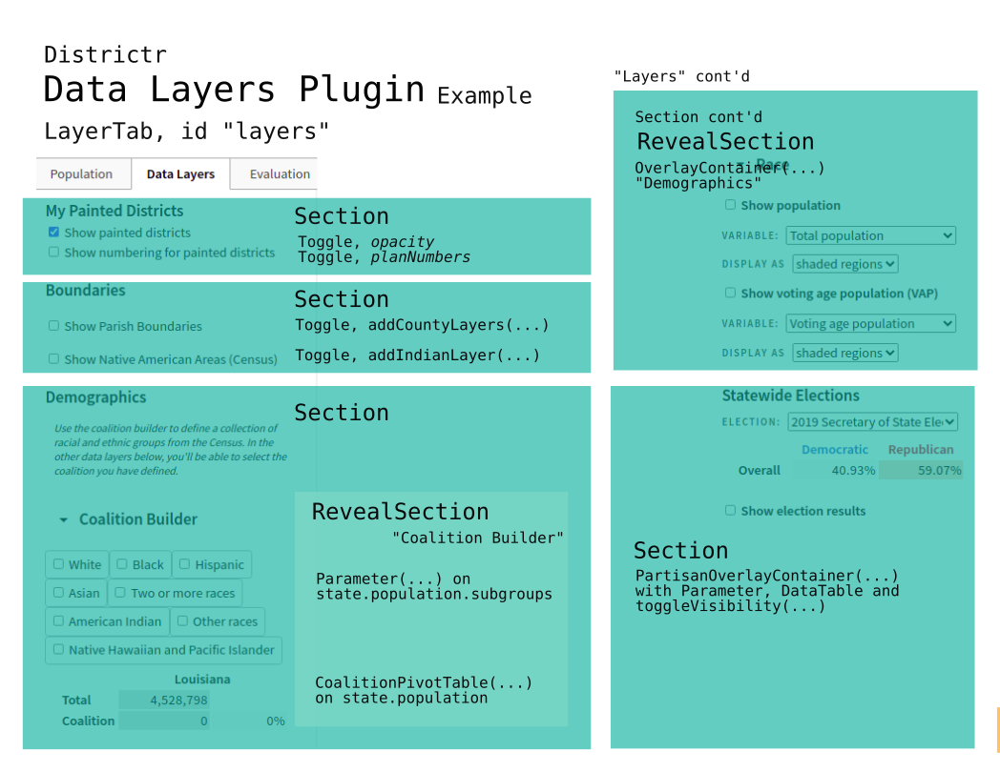

# The Data Layers Plugin

As the [`ToolsPlugin`] serves as the function that displays a list of
map tools and [user interface] radio buttons, checkboxes and sliders
that allow users to control their properties, the `DataLayersPlugin`
loads information and UI related to data including toggles and tables.
In the [`Toolbar`], these are collected in the "Data Layers" [tab] that
has sections for map display options, tables related to race and
demographics and overlays related to population, coalition and
elections. 

The Data Layers Plugin is listed in `views/edit.js` as applicable when
in we edit in the `"default"` and `"communityId mode"`, but not when
we're in the "`coi2`" mode.

[@maxhully] innaugrated plugins with a commit on Tues., Apr. 23, 2019.
These plugins have been heavily maintained since, with [@mapmeld]'s
additions and [@jenni-niels]'s healthy maintenance starting in Sept.
2019. More recent updates have been applied by [@jdeschler].

## [/src/plugins/data-layers-plugin.js]

The `data-layers-plugin.js` file holds a single default plugin
`DataLayersPlugin(editor)` that is created when the [`Editor`] is
initialized. Having taken a list of plugins from `edit.js`, the `Editor`
calls each plugin one by one using itself as the parameter. 

The foundation for this plugin is a `LayerTab(...)` created to hold each
[`Section`] described below. We add elements to this local `tab` until
and apply `toolbar.addTab(tab)` to have it render inside the document
right-hand panel Toolbar.

### Communities/District Section
  
Data Layers Plugin is responsible for creating a tab and adding sections
using `tab.addSection(...)`, each of which are fed render functions.
This first section concerns the basics of toggling [`map`] [layers]. Its
heading, messages and labels are dependent on whether we're working with
Communities or Districts are being painted.
Elements include... 

- The Heading, either "Communities" or "Districts"
- Show Communities/Districts `toggle` that sets state.units opacity.
Remember, `state.units` is of type `Layer`
- Show Communities/Districts numbers `toggle`, which if appropriate to
the plan.context place if permitted by `spatial_abiities(...)`. This is
done by querying `state.numbers.forEach((number)`. Remember,
`state.numbers` is an array of `Layer`s
- Show counties with ` addCountyLayer(tab, state)` from
`layers/counties.js` if appropriate.
  
## Naming Neighborhoods
  
If we're in communities mode and it permitted by `spatial_abilities`
under the `neighborhoods` property, we create an additional section that
allows uers to name neighborhoods. This is done by using
`setLayoutProperty(...)` on the mapboxgl `editor.map` to set
`settlement-label` and `settlement-subdivision-label` properties.

## Optional Sections
  
Optional sections are contingent on hard-coded logic that generally
sources   a new [`Layer`] from `/assets/` and includes a toggle button
for display in the map with display characteristics like line color and
width. Sometimes, a labels layer is loaded in parallel. For more
information, check out the full inventory of [Spatial Exceptions].
Loadable layers include...
  
- "Show Boundary", from `/assets/city_border/`
- "Show Boundary", from `/assets/current_districts/`
- "Voter Precincts", from `/assets/current_districts/`
- "School Districts", from `/assets/current_districts/`
- "Cities and Towns" from `/assets/current_districts/`
- "Enacted Plans" from `assets/current_districts/`
- "Boundaries" from `/assets/current_districts/`
  
Finally, the following layers are loaded when permitted by
`spatial_abilities(state.place.id)`.

- American Indian Districts from `addAmerIndianLayer(tab, state)`
- Current Districts from `addCurrentDistricts(tab, state)`
- Communities of Interest, in coi mode, from  `addMyCOI(state, tab)`

###  Demographics
  
Districtr allows for the overlay and tabulation of demographic
information. The [`Demographics`] section is created when we call
`tab.createSection(...)` and contains four potential Reveal Sections...

- the `Coalition Builder`, a combination of races
- 'Race'
- `Socioeconomic data` and
- [`Previous Elections`].

### Coalition Groups
  
The combination of races that comprise a Coalition is kept as a global
object variable known as `window.coalitionGroups`. After the
Demographics section is created, we first create a
`CoalitionPivotTable` object as a local variable. 

We then create `tab.addRevealSection("Coalition Builder"...)`. Inside a
[`Parameter`], for each subgroup in non-total
`state.population.subgroups`, we create a `toggle` element that adds
each race to the global object of `coalitionGroups` and render the
`coalitionPivotTable` object we created earlier. In the document, this
table is kept in a div id `#coalition-table`. This reveal is initially
closed by default.

### Overlay Containers

An Overlay Container provides the user the option to plot information
directly on the map. Two OverlayContainers can be created corresponding
to Demographics, and if present, VAP or CVAP. These are loaded into new
Reveal Section `tab.addRevealSection("Race"...)` which is default to
stay open on load.

If present as `state.median_income` or `state.rent`, median income and
perecent renters can also be depicted as Overlay Containers under Reveal
Section "Socioeconomic data." As a scalar value, Median Income can be
represented as a simple Overlay Container. Rental percentage, on the
other hand, is a proportion, which we model similar to elections. Thus,
a new `Election` object is created from rental precentage data and a
`PartisanOverlayLayer` is used to depict this data. When rendered in the
document, a green-orange bar indicating percent functions as a legend. 
  
### Elections
  
Finally, if there exists `state.elections`, a new reveal section is
created titled "Previous Elections." The contents of `state.elections`
is sent to `PartisanOverlayContainer`, which is responsible for
depicting a radio list of available elections and depicting them in the
map. This section is open to the user by default. More information on
[election results] is described in this chapter.
 
# #

### Suggestions

- Since `edit.js` lists plugins to load by `problem.type`, it is
redundant to have so many use cases depend on the difference between
`districting` and `community` modes. With the proper management of
helper functions, it's probably easier to just write two separate data
plugins for districting and coi modes.
- This sprawling functions has become so because of the many, many hard
coded cases and exceptions for loading a variety of similar layers.
Surely, one can imagine consolidating loadable layers in a director, say
`spatial-abilities` itself, and creating a `makeGenericLayer` class to
read in sources, labels, and so on. This could cut the amount of code by
half. 
- A result of having so many use cases is that the places where json
source data loads and where it is added as a layer and toggle button is
separated. This makes it hard to see that, say, the ids `lax`'s current
2013 districts' source in the map is titled, with `va` instead of `lax.`
- When rendering the rent overlay legend bars, the notches are rendered
inside a  div class '.vap' and not say "rent".
- When loading early city example Lowell, MA, is loaded a hard coded
coalition is written as default. Maybe this can be removed or moved to
`spatial_abilities.` 
- `vapEquivalents` is a reference table that converts standard census
population codes into vap codes. Could this constant be kept above or
folded into `../components/Charts/CoalitionPivotTable`?

# #

[Return to Main](../README.md)
- Plugins for Data
  - Next: [Population Balance Plugin](../06charts/popbalanceplugin.md)
  - [The Evaluation Plugin](../06charts/evaluationplugin.md)
  - [The Population Model](../06charts/population.md)
- [Population Bar Chart](../06charts/populationbarchart.md)
- [Column-Sets and Parts](./06charts/columnsetsparts.md)
  - [Two ways to explore election results](../06charts/electionresults.md)
- [Data, Pivot and Coalition Pivot Tables](../06charts/datatable.md)
  - [Demographics, Racial Balance and Age Histogram Tables](../06charts/demographicstable.md)
  - [Histograms](../06charts/histogram.md)
- [Highlighting Unassigned Units: Three Simple Functions](../06charts/higglightunassigned.md)
- [Dataset Info](../06charts/datasetinfo.md)
- [A Full Example: VRA](../06charts/vra.md)

[@maxhully]: http://github.com/maxhully
[@mapmeld]: http://github.com/mapmeld
[@jenni-niels]: http://github.com/jenni-niels
[@jdeschler]: http://github.com/jdeschler

[`Editor`]: ../02editormap/editor.md
[`map`]: ../02editormap/map.md
[layers]: ../02editormap/layer.md
[`Layer`]: ../02editormap/layer.md

[`Toolbar`]: ../03toolsplugins/toolbar.md

[`ToolsPlugin`]: ../03toolsplugins/toolsplugin.md
[user interface]: ../03toolsplugins/uicomponents.md
[tab]: ../03toolsplugins/uicomponents.md
[`Section`]: ../03toolsplugins/sections.md
[`Parameter`]: ../03toolsplugins/uicomponents.md

[`Demographics`]: ../06charts/demographicstable.md
[`Previous Elections`]: ../06charts/electionresults.md

[`spatial_abilities`]: ../10spatialabilities/spatialabilities.md
[Spatial Exceptions]: ../10spatialabilities/placeexceptions.md

[/src/plugins/data-layers-plugin.js]: ../../src/plugins/data-layers-plugin.js

# #

[The Metric Geometry and Gerrymandering Group Redistricting Lab](http://mggg.org)

Tufts University, Medford and Somerville, MA