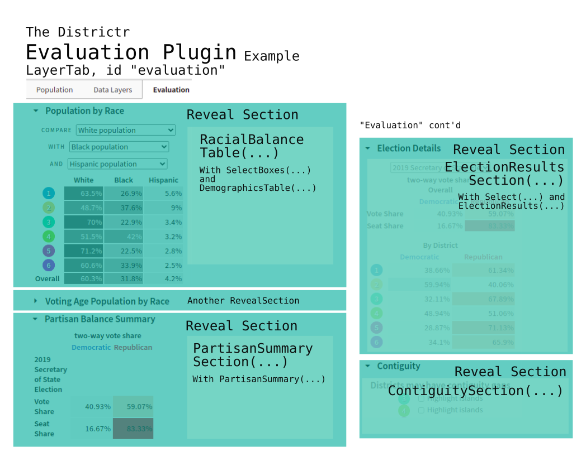

# The Evaluation Plugin 

The `EvaluationPlugin` is part of the default plugins loaded when the
aim is to draw a plan with districts, as opposed to drawing
[communities]. The tab's primary responsibility is to hold data tables
that calculate population or partisanship across drawn districts.
Controls for displaying contiguity is also found here. 

Originally part of a plugins pack on April 23, 2019 by [@maxhully], it
has been maintained by [@mapmeld] since March, 2020, who added
contiguity check in March and Age Table in April.

[@jenni-niels] adds [VRA] functionality in the Spring of 2021. The both
mentioned above maintain this with recent help from [@jdeschler].

## [/src/plugins/evaluation-plugin.js]

The evaluation tab runs through an [`editor`]'s [`state`] [context/plan]
through series of case conditions that determine what components to load
in the "Evaluation" tab of the `Toolbar`. 

First, a `mockColumnSet` is created to include a user-specified
coalition in the columns of a population. Then each component is loaded
by condition. 

- Default Reveal Section "Population by Race" featuring
[`RacialBalanceTable`] including `mockColumnSet` 
- "Voting Age Population by Race" `RacialBalanceTable` if `state.vap`
- "Citizen Voting Age Population by Race" `RacialBalanceTable` if
`state.cvap`
- "Partisan Balance Summary" `PartisanSummarysection` if any
`state.elections`
  - "Election Details" `ElectionResultsSection` if any `state.elections`
  - "Age Histograms" [`AgeHistogramTable`] if `state.ages`
- [`ContiguitySection`] if permitted by [`spatial_abilities`] and is not
`ma_towns`. 
- A second tab related to [VRA]

# #

### Suggestions

- Two equivalent if statements `state.elections.length > 0` should be
combined.
- Initial `isOpen` states can be delegated to a helper function.
- One can simplify the contiguity if statement as this plugin is never 
called if `problem.type` is "community"
- Separate out VRAtab as new plugin. 

# #

[Return to Main](../README.md)
- Plugins for Data
  - [The Data Layers Plugin](../06charts/datalayersplugin.md)
  - Previous: [Population Balance Plugin](../06charts/popbalanceplugin.md)
- [The Population Model](../06charts/population.md)
- [Population Bar Chart](../06charts/populationbarchart.md)
- [Column-Sets and Parts](./06charts/columnsetsparts.md)
  - [Two ways to explore election results](../06charts/electionresults.md)
- [Data, Pivot and Coalition Pivot Tables](../06charts/datatable.md)
  - [Demographics, Racial Balance and Age Histogram Tables](../06charts/demographicstable.md)
  - [Histograms](../06charts/histogram.md)
- [Highlighting Unassigned Units: Three Simple Functions](../06charts/highlightunassigned.md)
- [Dataset Info](../06charts/datasetinfo.md)
- [A Full Example: VRA](../06charts/vra.md)

[@maxhully]: http://github.com/maxhully
[@mapmeld]: http://github.com/mapmeld
[@jenni-niels]: http://github.com/jenni-niels
[@jdeschler]: http://github.com/jdeschler

[/src/plugins/evaluation-plugin.js]: ../../src/plugins/evaluation-plugin.js

[context/plan]: ../01contextplan/plancontext.md
[`state`]: ../01contextplan/state.md

[`editor`]: ../02editormap/editor.md

[`ContiguitySection`]: ../04drawing/contiguity.md

[communities]: ../05landmarks/coi.md

[VRA]: ../06charts/vra.md
[`RacialBalanceTable`]: ../06charts/demographicstable.md
[`AgeHistogramTable`]: ../06charts/demographicstable.md

[`spatial_abilities`]: ../10spatialabilities/spatialabilities.md

# #

[The Metric Geometry and Gerrymandering Group Redistricting Lab](http://mggg.org)

Tufts University, Medford and Somerville, MA