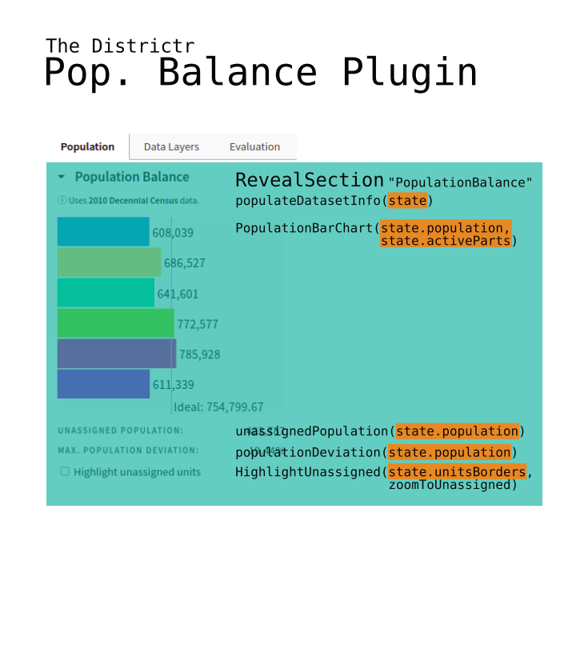

# Population Balance Plugin



The `PopulationBalancePlugin` is loaded by [`edit.js`] and is included
in the list of default plugins, i.e. when painting districts and not
communities, by [`ToolsPlugin`]. A [`Tab`] of id `criteria` titled
"Pop." or "Population" is loaded in the [`Toolbar`] using the default
function, requiring only the main `editor` as an argument.

Its typical function is to 
- report information about the dataset,
- produce a [PopulationBarChart]
- cause the calculation and display of the unassigned population
- cause the calculation and display of the population deviation. 

In the rare case we are working with multimember districts as we do only 
in the Chicago, IL or Santa Clara, CA City Council and the Vermont State
Senate, a `MultiMemberPopBalanceChart` is used instead and no Population
Deviation is calculated. 

> The zoomToUnassigned function also lives here. 

## Unassigned Population

The entire `UnassignedPopulation.js` code is listed below. 

```
import { html } from "lit-html";
import { numberWithCommas, sum } from "../../utils";

export default population => {
    const totalAssignedPop = sum(population.total.data);
    const unassignedPop = Math.round(population.total.sum - totalAssignedPop);
    return html`
        <div class="ui-option ui-option--slim">
            <dt class="ui-label ui-label--row">Unassigned population:</dt>
            <dd class="ui-data">${numberWithCommas(unassignedPop)}</dd>
        </div>
    `;
};
```

The sum of the districts and the total sum of population is calculated
from `state.population`, in the `State` object, and displayed.

## Population Deviation

With the same imports as above, the entire `PopulationDeviation.js` code
is listed below.

```
export default population => {
    let deviations = population
        .deviations()
        .filter(d => d != -1) // leave out empty districts
        .map(d => Math.abs(d));
    if (deviations.length == 0) {
        deviations.push(1);
    }
    const maxPopDev = Math.max(...deviations);
    return html`
        <div class="ui-option ui-option--slim">
            <dt class="ui-label">Max. population deviation:</dt>
            <dd class="ui-data">${roundToDecimal(maxPopDev * 100, 2)}%</dd>
        </div>
    `;
};
```
This function uses `Population`'s instance variable to produce
deviations for each district. The maximum absolute deviation across all
districts is represented as a percentage.

# #

### Suggestions 

- So much is similar with single and multimember districts, we could use
in-line if statements
- Both Population Deviation and Unassigned Population are short and can
be combined in the pop-balance-plugin file
- ZoomToUnassigned should be moved to Unassigned.js 

# #

[Return to Main](../README.md)
- Plugins for Data
  - Previous: [The Data Layers Plugin](../06charts/datalayersplugin.md)
  - Next: [The Evaluation Plugin](../06charts/evaluationplugin.md)
- [The Population Model](../06charts/population.md)
- [Population Bar Chart](../06charts/populationbarchart.md)
- [Column-Sets and Parts](./06charts/columnsetsparts.md)
  - [Two ways to explore election results](../06charts/electionresults.md)
- [Data, Pivot and Coalition Pivot Tables](../06charts/datatable.md)
  - [Demographics, Racial Balance and Age Histogram Tables](../06charts/demographicstable.md)
  - [Histograms](../06charts/histogram.md)
- [Highlighting Unassigned Units: Three Simple Functions](../06charts/highrlightunassigned.md)
- [Dataset Info](../06charts/datasetinfo.md)
- [A Full Example: VRA](../06charts/vra.md)


[`State`]: ../01contextplan/state.md

[`edit.js`]: ../02editormap/editor.md

[`ToolsPlugin`]: ../03toolsplugins/toolsplugin.md
[`Toolbar`]: ../03toolsplugins/toolbar.md
[`Tab`]: ../03toolsplugins/uicomponents.md

[PopulationBarChart]: ../06charts/populationbarchart.md

# #


[The Metric Geometry and Gerrymandering Group Redistricting Lab](http://mggg.org)

Tufts University, Medford and Somerville, MA