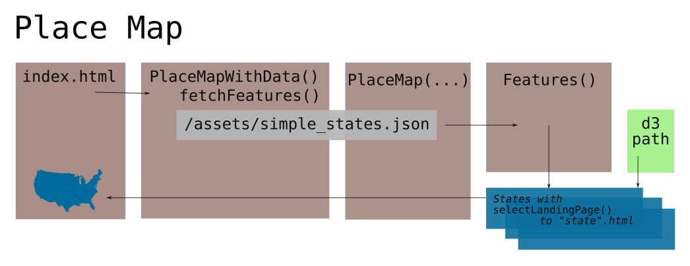

# The Place Map

The Place Map is featured on some pages as a map of the United States
that allows users to navigate to State Landing Pages. It is a rendered
vector map with insets for Hawaii, Alaska, DC and Puerto Rico. It once
had rich data display features but much of that is vestigial. Currently,
it only allows users to highlight a state and on click, navigate to that
state's landing page. 

The `PlaceMap` is stored in [`src/components/PlaceMap.js`]

## `PlaceMapWithData` and `PlaceMap` 

When called externally by [`community.js`], [`new.js`] or [`index.js`],
`PlaceMapWithData()` is usually called. Originally, this function would
parse out a specific postal-code from the window address. This
`selectedId` is now deprecated and `PlaceMap` now only contributes a
dropdown form select id `#place-search` within div class
`.place-map__form` that allows users to select their preferred state and
updates on the hover of a map. 

The actual rendering and hovering of svg features is done when the
`fetcheFeatures(...)` is called, which collects features from
[`assets/simple_states.json`]  and are sent to `Features(...)`.

## `Features(features, onHover, selectedId)`

Nearly unique among distrctr, the `Features(...)` function returns an
svg object with links and listners rather than an html object.
(Only [`PopulationBarChart`] does the same.) When we once used
`selectedId`, the map would be transform around the selected feature,
but this is no more. A hover callback function `noHover(...)` is applied
to the entire svg group for `mouseLeave` events. 

### Fetch Features

Typically, the features plotted by `Features` is provided by the
function `fetchFeatures(...)` whose task is to read the features kept in
`assets/simple_states.json`.

> Originally, features were filtered here depending on availability and
whether we were in community mode, but this is mostly deprecated. 

Back in the `Features` function, a path is generated with the following
propeties...
- `class`, provided by function `featureClasses(...)`
- `stroke`,`stroke-width` and `stroke-linecap`, hard coded values for a
black line
- `style`, usually set to `"cursor:default"`
- `d`, the actual point coordinates of the borders of a state. This is
generated by submitting the feature to a `geoPath(...)` helper function
that generate points based on map projection, scale and translation. We
adopt this form from the [D3 javascript library].
- the applicaion of the `onHover(feature)` callback for `mouseover`
events
- the application of `selectLandingPage(feature)` callback for
`mouseClick` events.

A special case is applied to DC. Already having been plotted as an inset
using the `altpath` geo function, a path of class `.dc-annotation` plots
a line between the main map and the inset. 

> Communities and local areas were once plotted together with states and
territories. This is no more. Points were once filtered out to prevent
their display, but this is no longer necessary.

# #

### Suggestions 

So much is deprecated from the days when local communities were either
displayed, then listed, then sent straight to state landing page. 

# # 

[Return to Main](../README.md)
- [The Index Landing Page](../07pages/index.md)
- Previous: [Districtr State Pages](../07pages/districtrstatepages.md)

[`community.js`]: ../05landmarks/coi.md
[`new.js`]: ../02editormap/initialization.md
[`index.js`]: ../02editormap/editor.md

[`assets/simple_states.json`]: ../../assets/simple_states.json
[`src/components/PlaceMap.js`]: ../../src/components/PlaceMap.js

[`PopulationBarChart`]: ../06charts/populationbarchart.md
[D3 javascript library]: http://d3js.org

# #

[The Metric Geometry and Gerrymandering Group Redistricting Lab](http://mggg.org)

Tufts University, Medford and Somerville, MA