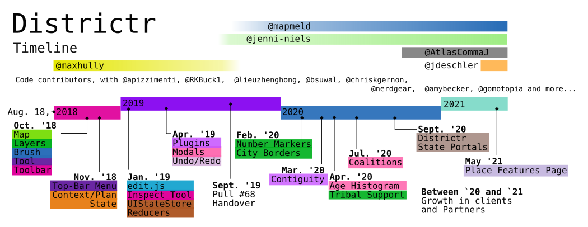
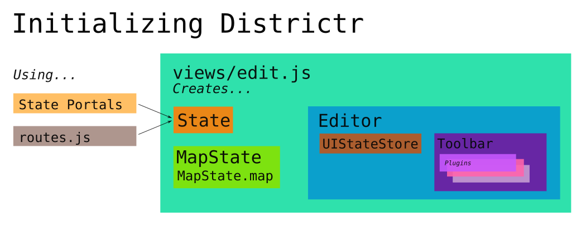
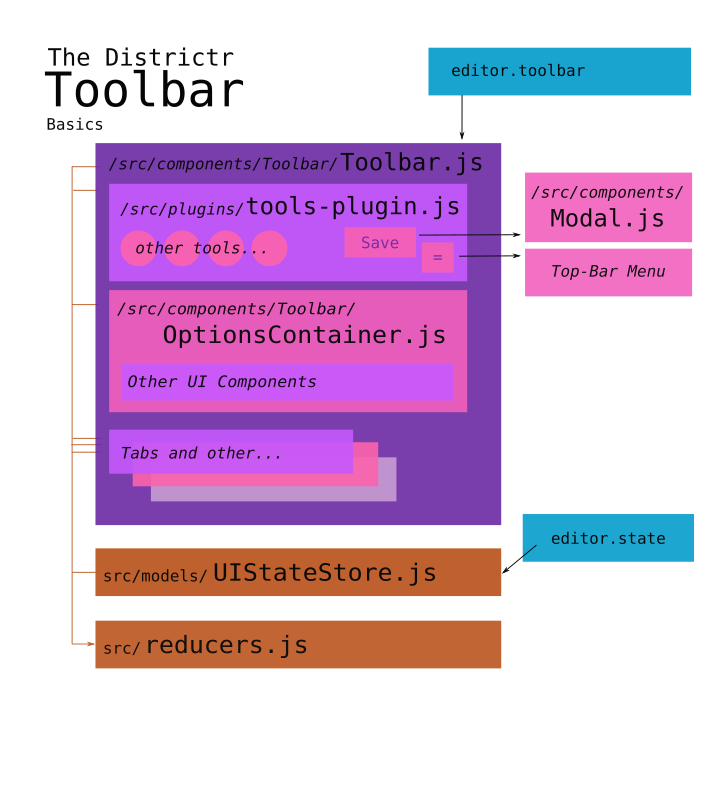
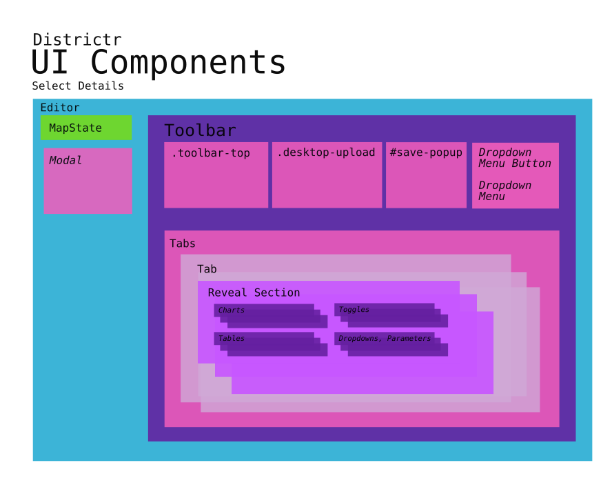
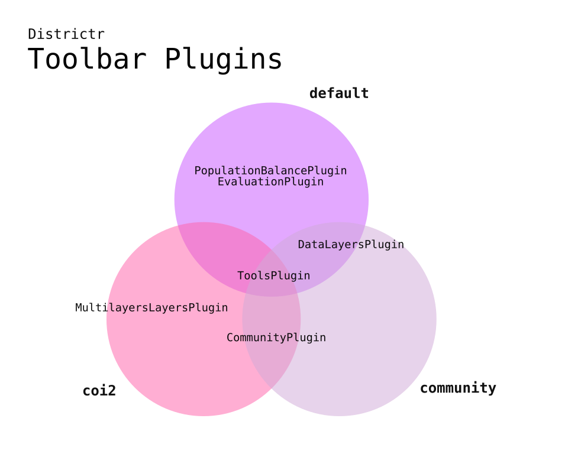
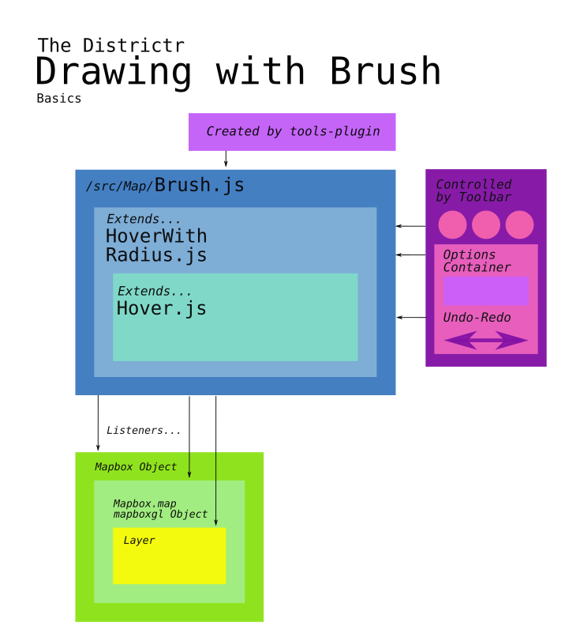
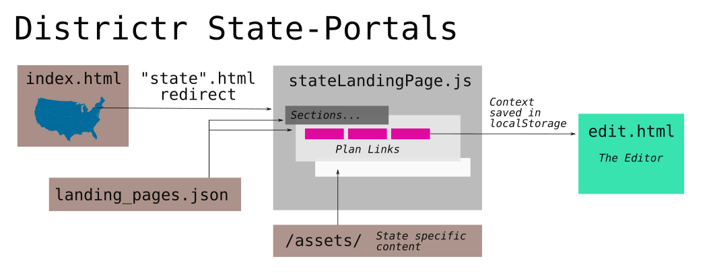

# The Story of [Districtr]

In the name of Democracy, "Districtr is a free, public web tool for
districting and community identification, brought to you by the
[MGGG Redistricting Lab]." Districtr allows citizens to draw maps and
calculate demographics to help with the drawing of districts large and
small.

This app was born on Sat. Aug. 18, 2018. What began with [@maxhully]'s
Sept. 2018 [Mapbox] experiments has bloomed into a vital app that many
citizens and state redistricting comissions rely on for governing the
district boundaries that in turn, govern us. Over time, many creative
minds in Mathematics, Computer Science, Geography and Politics have
converged to promote transparent and good governance as a new decade is
born. 

As of June, 2021, Districtr is managed by MGGG, a research group at the
Tisch College of Civic Life, at Tufts University near Boston, Mass., led
by Principal Investigator, Moon Duchin, Associate Professor of
Mathematics and her dedicated [team].

## 1. The Districtr JSON context/plan model
Distirctr keeps track of a specific problem or assignment of a certain
region, its districts and units used in a model described in the
following model.

- [The Plan/Model JSON](./01contextplan/plancontext.md)
- [The State Object](./01contextplan/state.md)

## 2. Initializing: the Editor and its Map

- [How is the Districtr Editor page loaded?](./02editormap/initialization.md)
- [edit.js and the Editor Object](./02editormap/editor.md)
- [The Map Object](./02editormap/map.md)
- [Adding Layers](./02editormap/layer.md)
- [Number Markers](./02editormap/numbermarkers.md)
- [Layer Overlay](./02editormap/layeroverlay.md)

## 3. User Interace: Tools and Plugins 

- [Making space for the Toolbar](./03toolsplugins/toolbar.md)
  - [Tabs and Reveal Sections](./03toolsplugins/sections.md)
  - [A List of UI and Display Components](./03toolsplugins/uicomponents.md)
  - [Rendering in Action: OptionsContainer](./03toolsplugins/optionscontainer.md)
  - [The top-bar Menu](./03toolsplugins/topmenu.md)
  - [Popups a la Modal](./03toolsplugins/modal.md)

- [UIStateStore](./03toolsplugins/uistatestore.md)
- [Actions and Reducers](./03toolsplugins/actionsreducers.md)

- [The Tools-Plugin prevails](./03toolsplugins/toolsplugin.md)
  - [The `Tool` Class and The `Pan` Tool](./03toolsplugins/tool.md)
  - [Brush and Erase Tools](./03toolsplugins/brusherasetools.md)
  - [Inspect Tool](./03toolsplugins/inspecttool.md)

- [Plugins!](./03toolsplugins/plugins.md)
  - The Tools Plugin (See Above)
  - The Data Layers Plugin (See Chapter 06)
  - The Community Plugin (See Chapter 05)
  - The Population Balance Plugin (See Chapter 06)

## 4. User Interaction: Drawing Districts

- [Hovering over the Map](./04drawing/hover.md)
- [Painting and Erasing with Brush and Community Brush](./04drawing/brush.md)
- [Undo and Redo](./04drawing/undoredo.md)
- [The Tooltip Brush](./04drawing/tooltip.md)
- [Checking for Contiguity](./04drawing/contiguity.md)

## 5. Interesting Communities and Landmarks

- [Communities of Interests in Use](./05landmarks/coi.md)
- [The Landmark Class](./05landmarks/landmarksclass.md)
- [The Community Plugin](./05landmarks/communityplugin.md)
- [The Old Landmark Tool](./05landmarks/landmarktool.md)
- [My COI](./05landmarks/mycoi.md)
- [Finding Places](./05landmarks/findplaces.md)

## 6. Charts and Analysis

- Plugins for Data
  - [The Data Layers Plugin](./06charts/datalayersplugin.md)
  - [Population Balance Plugin](./06charts/popbalanceplugin.md)
  - [The Evaluation Plugin](./06charts/evaluationplugin.md)
- [The Population Model](./06charts/population.md)
- [Population Bar Chart](./06charts/populationbarchart.md)
- [Column-Sets and Parts](./06charts/columnsetsparts.md)
  - [Two ways to explore election results](./06charts/electionresults.md)
- [Data, Pivot and Coalition Pivot Tables](./06charts/datatable.md)
  - [Demographics, Racial Balance and Age Histogram Tables](./06charts/demographicstable.md)
  - [Histograms](./06charts/histogram.md)
- [Highlighting Unassigned Units: Three Simple Functions](./06charts/highlightunassigned.md)
- [Dataset Info](./06charts/datasetinfo.md)
- [A Full Example: VRA](./06charts/vra.md)

## 7. Index and State Pages

- [The Index Landing Page](./07pages/index.md)
- [Districtr State Pages](./07pages/districtrstatepages.md)
- [PlaceMap](./07pages/placemap.md)

## 8. Events and Tags

- [Event Tags and Pages](./08events/event.md)

## 9. Routes, Servers and Deployment

- [Routes](./09deployment/routes.md)
- [Intro to districtr-eda](./09deployment/districtreda.md)
- [Intro to mggg-states](./09deployment/mggg-states.md)
- [Netlify Lambda Functions and MongoDB](./09deployment/mongolambdas.md)
- [Headers and Redirects](./09deployment/headersredirects.md)
- [package.json and npm](./09deployment/package.md)

## 10. Spatial Abilities and Exceptions

- [Spatial Abilites](./10spatialabilities/spatialabilities.md)
- [Inventory of Place Based Exceptions](./10spatialabilities/placeexceptions.md)
- [Utilities](./10spatialabilities/utils.md)

## 11. Grand Suggestions

- [My Personal Philosophy on Functions](./11suggestions/philosophy.md)
- [Deprecations and Experimental Features](./11suggestions/deprecations.md)
- [Clarifying Operations](./11suggestions/clarity.md)
- [Logical Redundancies](./11suggestions/logic.md)
- [Organization](./11suggestions/organizing.md)
- [The Heavy Lift: (Not) Global Objects](./11suggestions/globalobjects.md)
- [Other Notes](./11suggestions/other.md)

## 12. The Team
- [The Team](./12team/theteam.md)
- [Inventory of Contributions](./11suggestions/contributions.md)

## Colophon
This documentation covers the state of districtr on [Tues., June 1, 2021]. 
Further changes will be noted periodically.

# #

[The Metric Geometry and Gerrymandering Group Redistricting Lab](http://mggg.org)

Tufts University, Medford and Somerville, MA

[Tues., June 1, 2021]: https://github.com/districtr/districtr/commit/6da65021cdbcf76022c0d8603e67111a3455b25f

[@maxhully]: http://github.com/maxhully
[Mapbox]: https://docs.mapbox.com/mapbox-gl-js/api/
[districtr]: http://districtr.org
[MGGG Redistricting Lab]: http://https://mggg.org/
[team]: ./12team/theteam.md